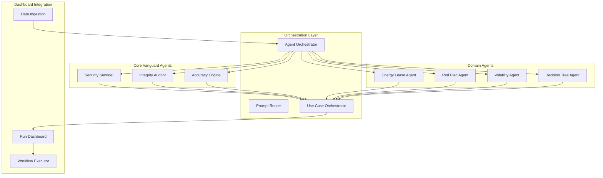
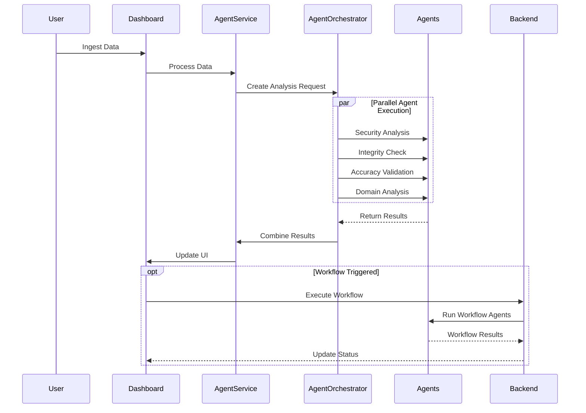

# Agent Orchestration Integration Plan

## Overview
This document outlines how the VANGUARDS agent system integrates with the run dashboard to provide real-time data enrichment, analysis, and automated workflows.

## Agent Architecture Overview

### 1. Agent Types and Responsibilities



### 2. Agent Integration Points

```typescript
interface AgentIntegrationPoints {
  // Data Ingestion Hook
  onDataIngested: {
    trigger: 'automatic' | 'manual';
    agents: ['security-sentinel', 'integrity-auditor', 'accuracy-engine'];
    priority: 'high';
  };
  
  // Tab-Specific Analysis
  onTabActivated: {
    'financial': ['volatility', 'red-flag'];
    'risk': ['decision-tree', 'red-flag'];
    'operations': ['energy-lease', 'integrity-auditor'];
  };
  
  // User-Triggered Actions
  onExecuteWorkflow: {
    agents: string[];
    parameters: WorkflowParams;
    callback: (result: AgentResult) => void;
  };
}
```

## Integration Implementation

### 1. Agent Service Layer

```typescript
// packages/frontend/src/services/agentOrchestration.service.ts

export class AgentOrchestrationService {
  private wsConnection: WebSocket;
  private activeAgents: Map<string, AgentInstance>;
  private resultCache: Map<string, AgentResult>;
  
  constructor(
    private dashboardStore: DashboardStore,
    private auditLogger: AuditLogger
  ) {
    this.initializeWebSocket();
    this.setupAgentHandlers();
  }
  
  // Initialize WebSocket connection to agent backend
  private initializeWebSocket(): void {
    this.wsConnection = new WebSocket(AGENT_WS_ENDPOINT);
    
    this.wsConnection.onmessage = (event) => {
      const message = JSON.parse(event.data);
      this.handleAgentMessage(message);
    };
  }
  
  // Process data through agents after ingestion
  async processIngestedData(data: IngestedData): Promise<EnrichedData> {
    const agentRequests = this.createAgentRequests(data);
    
    // Execute core VANGUARD analysis
    const siaResults = await Promise.all([
      this.executeAgent('security-sentinel', data),
      this.executeAgent('integrity-auditor', data),
      this.executeAgent('accuracy-engine', data)
    ]);
    
    // Execute domain-specific agents
    const domainResults = await this.executeDomainAgents(data);
    
    // Combine results
    return this.combineAgentResults(siaResults, domainResults);
  }
  
  // Execute specific agent
  async executeAgent(
    agentId: string, 
    data: any, 
    params?: AgentParams
  ): Promise<AgentResult> {
    // Check cache first
    const cacheKey = this.getCacheKey(agentId, data, params);
    if (this.resultCache.has(cacheKey)) {
      return this.resultCache.get(cacheKey)!;
    }
    
    // Send to agent
    const request: AgentRequest = {
      id: generateRequestId(),
      agentId,
      data,
      params,
      timestamp: new Date().toISOString()
    };
    
    // Log to audit system
    this.auditLogger.logAgentExecution(request);
    
    // Execute and cache result
    const result = await this.sendAgentRequest(request);
    this.resultCache.set(cacheKey, result);
    
    return result;
  }
}
```

### 2. Real-time Agent Updates

```typescript
interface AgentUpdateHandler {
  // Handle real-time updates from agents
  handleAgentMessage(message: AgentMessage): void {
    switch (message.type) {
      case 'ANALYSIS_UPDATE':
        this.updateDashboardWithAnalysis(message.data);
        break;
        
      case 'ALERT':
        this.showAgentAlert(message.alert);
        break;
        
      case 'RECOMMENDATION':
        this.displayRecommendation(message.recommendation);
        break;
        
      case 'WORKFLOW_TRIGGER':
        this.triggerWorkflow(message.workflow);
        break;
    }
  }
  
  // Update specific dashboard components
  private updateDashboardWithAnalysis(analysis: AgentAnalysis): void {
    const { agentId, results, affectedTabs } = analysis;
    
    // Update global state
    this.dashboardStore.updateAgentResults(agentId, results);
    
    // Notify affected tabs
    affectedTabs.forEach(tab => {
      this.notifyTab(tab, results);
    });
  }
}
```

### 3. Agent-Driven UI Components

```typescript
// Reusable component for displaying agent insights
export const AgentInsightPanel: React.FC<{
  agentId: string;
  data: any;
}> = ({ agentId, data }) => {
  const [insights, setInsights] = useState<AgentInsight[]>([]);
  const [loading, setLoading] = useState(true);
  
  useEffect(() => {
    const fetchInsights = async () => {
      const agentService = new AgentOrchestrationService();
      const result = await agentService.executeAgent(agentId, data);
      setInsights(result.insights);
      setLoading(false);
    };
    
    fetchInsights();
  }, [agentId, data]);
  
  if (loading) return <LoadingSpinner />;
  
  return (
    <div className="agent-insight-panel">
      <h3>{getAgentName(agentId)} Analysis</h3>
      {insights.map((insight, idx) => (
        <InsightCard key={idx} insight={insight} />
      ))}
    </div>
  );
};

// SIA Score component with agent integration
export const EnhancedSIAMetrics: React.FC<{
  data: any;
  onAgentClick?: (agent: string) => void;
}> = ({ data, onAgentClick }) => {
  const [scores, setScores] = useState<SIAScores | null>(null);
  
  useEffect(() => {
    const calculateScores = async () => {
      const agentService = new AgentOrchestrationService();
      const results = await agentService.getSIAScores(data);
      setScores(results);
    };
    
    calculateScores();
  }, [data]);
  
  return (
    <div className="sia-metrics-enhanced">
      {scores && (
        <>
          <MetricBadge
            label="Security"
            score={scores.security}
            agent="security-sentinel"
            onClick={() => onAgentClick?.('security-sentinel')}
          />
          <MetricBadge
            label="Integrity"
            score={scores.integrity}
            agent="integrity-auditor"
            onClick={() => onAgentClick?.('integrity-auditor')}
          />
          <MetricBadge
            label="Accuracy"
            score={scores.accuracy}
            agent="accuracy-engine"
            onClick={() => onAgentClick?.('accuracy-engine')}
          />
        </>
      )}
    </div>
  );
};
```

### 4. Workflow Execution Integration

```typescript
interface WorkflowExecutor {
  // Execute workflow from Operations tab
  async executeWorkflow(
    workflowId: string,
    context: WorkflowContext
  ): Promise<WorkflowResult> {
    // Prepare workflow request
    const request: WorkflowRequest = {
      id: generateWorkflowId(),
      workflowId,
      context: {
        useCase: context.useCase,
        data: context.data,
        user: context.user,
        parameters: context.parameters
      },
      agents: this.selectAgentsForWorkflow(workflowId)
    };
    
    // Start execution
    const execution = await this.startWorkflowExecution(request);
    
    // Monitor progress
    return new Promise((resolve, reject) => {
      this.monitorExecution(execution.id, {
        onProgress: (progress) => {
          this.updateWorkflowProgress(progress);
        },
        onComplete: (result) => {
          this.handleWorkflowComplete(result);
          resolve(result);
        },
        onError: (error) => {
          this.handleWorkflowError(error);
          reject(error);
        }
      });
    });
  }
  
  // Select appropriate agents for workflow
  private selectAgentsForWorkflow(workflowId: string): string[] {
    const workflowAgentMap: Record<string, string[]> = {
      'lease-renewal': ['energy-lease', 'decision-tree', 'integrity-auditor'],
      'risk-assessment': ['red-flag', 'volatility', 'security-sentinel'],
      'compliance-check': ['integrity-auditor', 'accuracy-engine'],
      'optimization': ['decision-tree', 'volatility', 'energy-lease']
    };
    
    return workflowAgentMap[workflowId] || [];
  }
}
```

### 5. Agent Result Visualization

```typescript
// Component for visualizing agent results in dashboard tabs
export const AgentResultsVisualization: React.FC<{
  agentId: string;
  results: AgentResult;
  viewType: 'chart' | 'table' | 'summary';
}> = ({ agentId, results, viewType }) => {
  const renderVisualization = () => {
    switch (viewType) {
      case 'chart':
        return <AgentChartView data={results.chartData} />;
      case 'table':
        return <AgentTableView data={results.tableData} />;
      case 'summary':
        return <AgentSummaryView summary={results.summary} />;
    }
  };
  
  return (
    <Card className="agent-results">
      <CardHeader>
        <h4>{getAgentName(agentId)} Results</h4>
        <Badge variant={results.status}>{results.status}</Badge>
      </CardHeader>
      <CardContent>
        {renderVisualization()}
        {results.recommendations && (
          <RecommendationsList items={results.recommendations} />
        )}
      </CardContent>
    </Card>
  );
};
```

### 6. Agent Orchestration Flow



## Agent Configuration

### 1. Agent Registry

```typescript
interface AgentRegistry {
  agents: {
    'security-sentinel': {
      id: 'security-sentinel';
      name: 'Security Sentinel';
      type: 'vanguard';
      capabilities: ['threat-detection', 'vulnerability-scan', 'access-control'];
      requiredData: ['user-actions', 'system-logs', 'network-traffic'];
    };
    'integrity-auditor': {
      id: 'integrity-auditor';
      name: 'Integrity Auditor';
      type: 'vanguard';
      capabilities: ['data-validation', 'consistency-check', 'audit-trail'];
      requiredData: ['transactions', 'modifications', 'checksums'];
    };
    'accuracy-engine': {
      id: 'accuracy-engine';
      name: 'Accuracy Engine';
      type: 'vanguard';
      capabilities: ['precision-analysis', 'error-detection', 'calibration'];
      requiredData: ['measurements', 'calculations', 'benchmarks'];
    };
    'energy-lease': {
      id: 'energy-lease';
      name: 'Energy Lease Analyzer';
      type: 'domain';
      capabilities: ['lease-analysis', 'expiration-tracking', 'revenue-optimization'];
      requiredData: ['lease-data', 'production-metrics', 'financial-records'];
    };
    // ... other agents
  };
}
```

### 2. Agent Communication Protocol

```typescript
interface AgentProtocol {
  // Request format
  request: {
    version: '1.0';
    id: string;
    timestamp: string;
    agent: string;
    action: 'analyze' | 'validate' | 'recommend' | 'execute';
    data: any;
    params?: {
      priority: 'low' | 'medium' | 'high' | 'critical';
      timeout?: number;
      options?: Record<string, any>;
    };
  };
  
  // Response format
  response: {
    version: '1.0';
    requestId: string;
    timestamp: string;
    agent: string;
    status: 'success' | 'error' | 'partial';
    results: {
      score?: number;
      insights?: Insight[];
      recommendations?: Recommendation[];
      alerts?: Alert[];
      data?: any;
    };
    metadata: {
      processingTime: number;
      confidence: number;
      dataPoints: number;
    };
  };
}
```

## Performance Optimization

1. **Agent Result Caching**: Cache frequently requested analyses
2. **Parallel Execution**: Run independent agents concurrently
3. **Progressive Enhancement**: Show basic results first, enhance with agent data
4. **Selective Execution**: Only run relevant agents based on context
5. **Background Processing**: Non-critical analyses run in background

## Security Considerations

1. **Agent Authentication**: Verify agent identity before accepting results
2. **Data Encryption**: Encrypt sensitive data sent to agents
3. **Result Validation**: Validate agent responses before displaying
4. **Audit Trail**: Log all agent interactions
5. **Access Control**: Restrict agent execution based on user permissions

## Error Handling

```typescript
class AgentErrorHandler {
  handleAgentError(error: AgentError): void {
    switch (error.type) {
      case 'TIMEOUT':
        this.handleTimeout(error);
        break;
      case 'INVALID_DATA':
        this.handleInvalidData(error);
        break;
      case 'AGENT_UNAVAILABLE':
        this.handleUnavailable(error);
        break;
      case 'EXECUTION_FAILED':
        this.handleExecutionFailure(error);
        break;
    }
    
    // Log error
    this.auditLogger.logAgentError(error);
    
    // Notify user
    this.showErrorNotification(error);
  }
  
  // Implement fallback strategies
  private getFallbackStrategy(agentId: string): FallbackStrategy {
    return {
      'security-sentinel': () => this.useBasicSecurityCheck(),
      'integrity-auditor': () => this.useManualValidation(),
      'accuracy-engine': () => this.useStatisticalValidation()
    }[agentId] || (() => this.useDefaultFallback());
  }
}