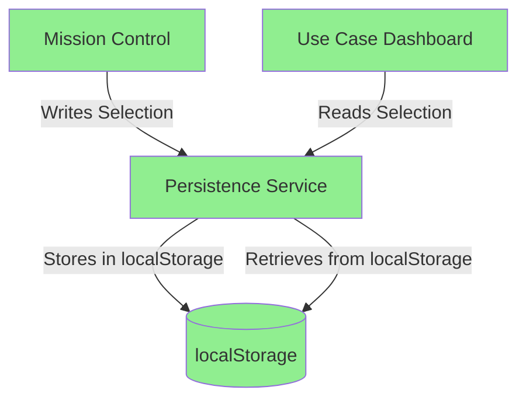
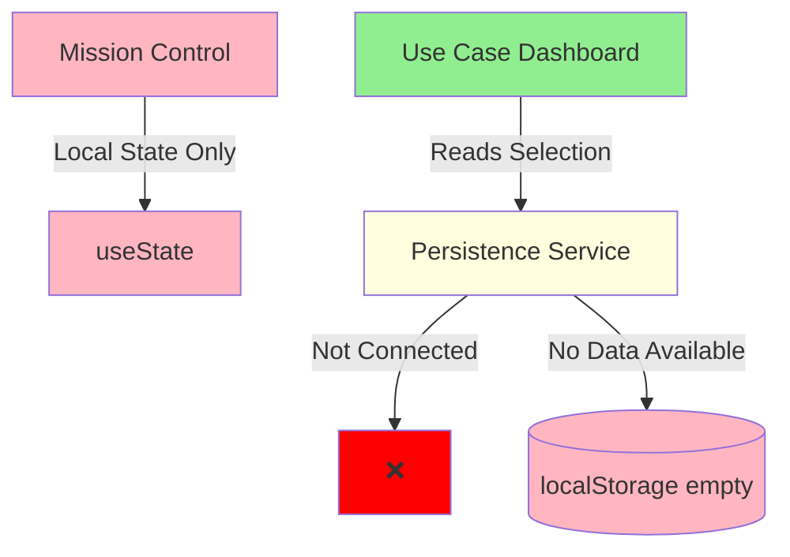

# Architecture vs Implementation Comparison

## What We Designed vs What We Built

### Designed Architecture (Correct)


### What We Actually Built (Incorrect)


## Component Status

### ✅ Correctly Implemented
1. **Use Case Dashboard**
   - Reads from persistence service
   - Shows blank state when no selection
   - Has clear selection functionality

2. **Persistence Service**
   - Properly saves/loads from localStorage
   - Has 24-hour expiration
   - Emits change events

3. **Hooks**
   - `useMissionControlPersistence` - works correctly
   - `useSelectedUseCase` - works correctly
   - `useAuditLogger` - works correctly

### ❌ Incorrectly Implemented
1. **Mission Control**
   - Uses local `useState` instead of persistence
   - Selection lost on navigation
   - No integration with persistence service

### ⚠️ Missing Components
1. **Use Case Orchestration Engine**
   - No orchestrator implemented
   - Direct imports instead of registry
   - No data pipeline

2. **Integration Tests**
   - No end-to-end tests
   - No persistence validation
   - No architectural compliance tests

## The Integration Gap

```
Mission Control                    Use Case Dashboard
┌─────────────────┐               ┌──────────────────┐
│                 │               │                  │
│  useState ----X │               │ ✓ Reads from     │
│                 │               │   Persistence    │
│  Should write   │               │                  │
│  to Persistence │               │ ✓ Shows correct  │
│                 │               │   UI             │
└─────────────────┘               └──────────────────┘
        ❌                                ✅
   Not Connected                    Correctly Built
   to Persistence
```

## Root Cause Analysis

### Why This Happened

1. **Bottom-Up Development**
   ```
   What we did:     UCD Components → Persistence → (Forgot MC Integration)
   Should have:     MC Integration → Persistence → UCD Components
   ```

2. **Assumption Without Verification**
   - Assumed: "Mission Control will use our persistence"
   - Reality: Mission Control has its own state management
   - Lesson: Always verify integration points first

3. **MVP Definition Problem**
   ```
   Our MVP:     Individual components working
   True MVP:    End-to-end flow working
   ```

## Validation Failures

### What We Should Have Tested First

```typescript
// Test 1: Mission Control writes to persistence
describe('Mission Control Persistence', () => {
  it('should save selection to localStorage', () => {
    // This would have failed immediately
    selectUseCase('energy-oilfield-land-lease');
    expect(localStorage.getItem('mission-control-state')).toContain('energy-oilfield-land-lease');
  });
});

// Test 2: End-to-end flow
describe('Use Case Selection Flow', () => {
  it('should persist selection across navigation', () => {
    // This would have exposed the integration issue
    navigateToMissionControl();
    selectUseCase('energy-oilfield-land-lease');
    navigateToUseCaseDashboard();
    expect(getDisplayedUseCase()).toBe('Oilfield Land Lease Management');
  });
});
```

## Lessons Learned

### 1. **Integration First, Components Second**
Build the connection between components before building the components themselves.

### 2. **Test the Critical Path**
The most important test is the one that validates the core user journey.

### 3. **Validate Assumptions**
Never assume an existing component works a certain way - verify it.

### 4. **Architecture Compliance Tests**
Create automated tests that verify architectural principles are followed.

## Fix Priority

### Immediate (Blocking Everything)
1. Make Mission Control use persistence service
2. Verify end-to-end flow works

### Important (Architectural Compliance)
1. Add integration tests
2. Create orchestration layer
3. Document integration points

### Nice to Have (Enhancements)
1. Real API connections
2. WebSocket support
3. Additional use case templates

## Conclusion

We built a beautiful car (Use Case Dashboard) with a perfect engine (Persistence Service), but forgot to connect the ignition (Mission Control) to the engine. The components are correct, but the integration is broken.

**Key Takeaway**: Always build and test the integration points first, then build the components that depend on them.