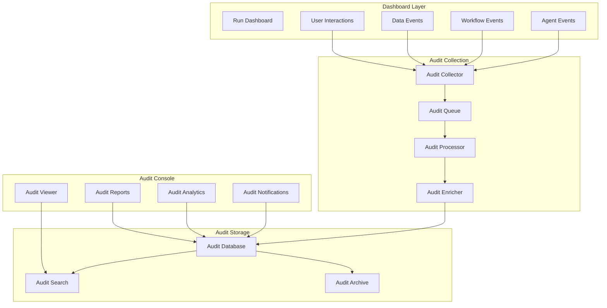
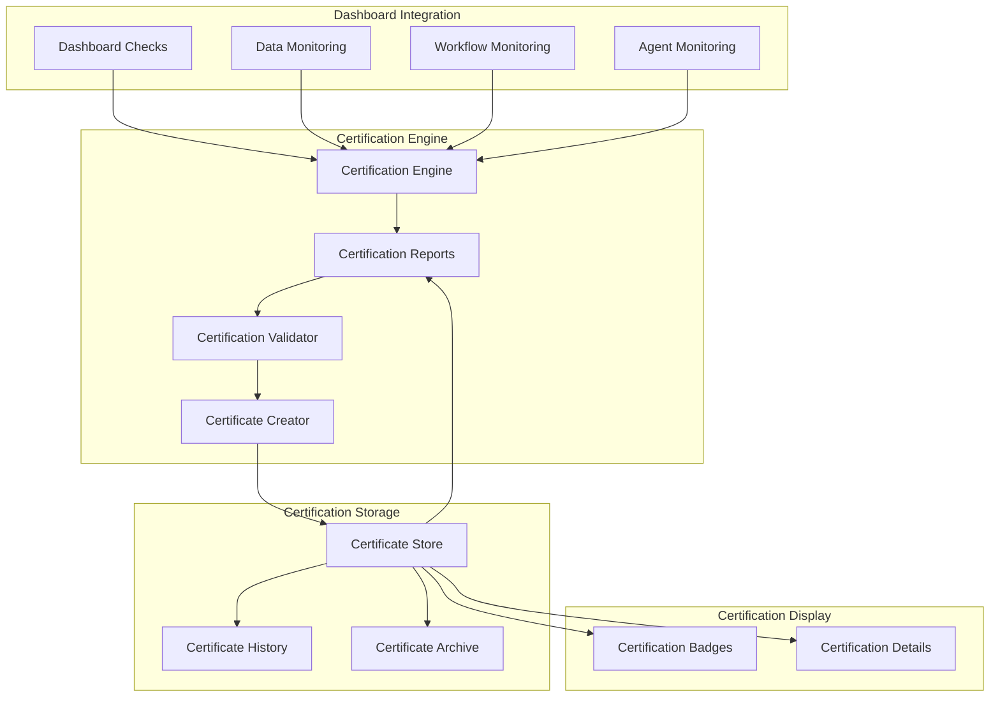

# Audit Console and Certifications Integration Plan

## Overview
This document outlines how the run dashboard integrates with the audit console for comprehensive logging and the certifications system for compliance tracking and validation.

## Audit Console Architecture

### 1. Audit System Overview



### 2. Audit Event Structure

```typescript
interface AuditEvent {
  // Event identification
  id: string;
  timestamp: string;
  type: AuditEventType;
  severity: 'info' | 'warning' | 'error' | 'critical';
  
  // Context information
  context: {
    dashboardId: string;
    sessionId: string;
    userId: string;
    useCase: string;
    environment: string;
  };
  
  // Event details
  event: {
    category: EventCategory;
    action: string;
    target?: string;
    result: 'success' | 'failure' | 'partial';
    duration?: number;
  };
  
  // Data payload
  data?: {
    before?: any;
    after?: any;
    changes?: any;
    metadata?: Record<string, any>;
  };
  
  // Security information
  security: {
    ipAddress: string;
    userAgent: string;
    authentication: string;
    authorization?: string[];
  };
  
  // Compliance tags
  compliance?: {
    regulations: string[];
    controls: string[];
    certifications: string[];
  };
}

enum AuditEventType {
  // Data events
  DATA_INGESTED = 'DATA_INGESTED',
  DATA_EXPORTED = 'DATA_EXPORTED',
  DATA_MODIFIED = 'DATA_MODIFIED',
  DATA_DELETED = 'DATA_DELETED',
  
  // User events
  USER_LOGIN = 'USER_LOGIN',
  USER_LOGOUT = 'USER_LOGOUT',
  USER_ACTION = 'USER_ACTION',
  
  // System events
  WORKFLOW_EXECUTED = 'WORKFLOW_EXECUTED',
  AGENT_EXECUTED = 'AGENT_EXECUTED',
  CONFIGURATION_CHANGED = 'CONFIGURATION_CHANGED',
  
  // Security events
  ACCESS_DENIED = 'ACCESS_DENIED',
  PERMISSION_CHANGED = 'PERMISSION_CHANGED',
  SECURITY_ALERT = 'SECURITY_ALERT'
}
```

### 3. Audit Service Implementation

```typescript
// packages/frontend/src/services/audit.service.ts

export class AuditService {
  private collector: AuditCollector;
  private queue: AuditQueue;
  private enricher: AuditEnricher;
  
  constructor() {
    this.collector = new AuditCollector();
    this.queue = new AuditQueue();
    this.enricher = new AuditEnricher();
    this.setupInterceptors();
  }
  
  // Setup automatic audit collection
  private setupInterceptors(): void {
    // Intercept API calls
    this.interceptAPIRequests();
    
    // Intercept user interactions
    this.interceptUserActions();
    
    // Intercept state changes
    this.interceptStateChanges();
    
    // Intercept errors
    this.interceptErrors();
  }
  
  // Log audit event
  async logEvent(event: Partial<AuditEvent>): Promise<void> {
    // Enrich event with context
    const enrichedEvent = await this.enricher.enrich(event);
    
    // Validate event
    if (!this.validateEvent(enrichedEvent)) {
      console.error('Invalid audit event:', enrichedEvent);
      return;
    }
    
    // Queue for processing
    await this.queue.add(enrichedEvent);
    
    // Process high-priority events immediately
    if (enrichedEvent.severity === 'critical') {
      await this.processImmediate(enrichedEvent);
    }
  }
  
  // Specific audit methods
  async auditDataIngestion(ingestion: DataIngestion): Promise<void> {
    await this.logEvent({
      type: AuditEventType.DATA_INGESTED,
      severity: 'info',
      event: {
        category: 'DATA',
        action: 'INGEST',
        target: ingestion.source,
        result: ingestion.success ? 'success' : 'failure',
        duration: ingestion.duration
      },
      data: {
        metadata: {
          recordCount: ingestion.recordCount,
          fileSize: ingestion.fileSize,
          format: ingestion.format,
          quality: ingestion.qualityScore
        }
      },
      compliance: {
        regulations: ['SOX', 'GDPR'],
        controls: ['DATA-01', 'DATA-02'],
        certifications: ['ISO-27001']
      }
    });
  }
  
  async auditWorkflowExecution(workflow: WorkflowExecution): Promise<void> {
    await this.logEvent({
      type: AuditEventType.WORKFLOW_EXECUTED,
      severity: workflow.success ? 'info' : 'error',
      event: {
        category: 'WORKFLOW',
        action: 'EXECUTE',
        target: workflow.id,
        result: workflow.success ? 'success' : 'failure',
        duration: workflow.duration
      },
      data: {
        metadata: {
          workflowName: workflow.name,
          steps: workflow.steps.length,
          completedSteps: workflow.completedSteps,
          errors: workflow.errors
        }
      }
    });
  }
  
  async auditAgentExecution(agent: AgentExecution): Promise<void> {
    await this.logEvent({
      type: AuditEventType.AGENT_EXECUTED,
      severity: 'info',
      event: {
        category: 'AGENT',
        action: 'EXECUTE',
        target: agent.agentId,
        result: agent.success ? 'success' : 'failure',
        duration: agent.duration
      },
      data: {
        metadata: {
          agentName: agent.name,
          score: agent.score,
          insights: agent.insights.length,
          recommendations: agent.recommendations.length
        }
      }
    });
  }
}
```

### 4. Audit Console Viewer Component

```typescript
// Embedded audit viewer in dashboard
export const AuditConsoleViewer: React.FC<{
  filters?: AuditFilters;
  embedded?: boolean;
}> = ({ filters, embedded = true }) => {
  const [events, setEvents] = useState<AuditEvent[]>([]);
  const [loading, setLoading] = useState(true);
  const [selectedEvent, setSelectedEvent] = useState<AuditEvent | null>(null);
  
  useEffect(() => {
    loadAuditEvents();
  }, [filters]);
  
  const loadAuditEvents = async () => {
    setLoading(true);
    try {
      const result = await auditService.queryEvents({
        ...filters,
        dashboardId: getDashboardId(),
        limit: embedded ? 50 : 1000
      });
      setEvents(result.events);
    } finally {
      setLoading(false);
    }
  };
  
  return (
    <div className={`audit-console ${embedded ? 'embedded' : 'full'}`}>
      {/* Audit Filters */}
      <div className="audit-filters mb-4">
        <Select
          value={filters?.severity}
          onChange={(severity) => updateFilter({ severity })}
          placeholder="Severity"
        >
          <option value="info">Info</option>
          <option value="warning">Warning</option>
          <option value="error">Error</option>
          <option value="critical">Critical</option>
        </Select>
        
        <Select
          value={filters?.category}
          onChange={(category) => updateFilter({ category })}
          placeholder="Category"
        >
          <option value="DATA">Data</option>
          <option value="USER">User</option>
          <option value="WORKFLOW">Workflow</option>
          <option value="AGENT">Agent</option>
          <option value="SECURITY">Security</option>
        </Select>
        
        <DateRangePicker
          value={filters?.dateRange}
          onChange={(dateRange) => updateFilter({ dateRange })}
        />
      </div>
      
      {/* Event List */}
      <div className="audit-events">
        {loading ? (
          <LoadingSpinner />
        ) : (
          <div className="space-y-2">
            {events.map((event) => (
              <AuditEventRow
                key={event.id}
                event={event}
                onClick={() => setSelectedEvent(event)}
                selected={selectedEvent?.id === event.id}
              />
            ))}
          </div>
        )}
      </div>
      
      {/* Event Details */}
      {selectedEvent && (
        <AuditEventDetails
          event={selectedEvent}
          onClose={() => setSelectedEvent(null)}
        />
      )}
    </div>
  );
};

// Audit event row component
const AuditEventRow: React.FC<{
  event: AuditEvent;
  onClick: () => void;
  selected: boolean;
}> = ({ event, onClick, selected }) => {
  return (
    <div
      className={`audit-event-row ${selected ? 'selected' : ''}`}
      onClick={onClick}
    >
      <div className="flex items-center justify-between">
        <div className="flex items-center space-x-3">
          <SeverityIcon severity={event.severity} />
          <div>
            <div className="text-sm font-medium">{event.event.action}</div>
            <div className="text-xs text-gray-500">
              {formatTimestamp(event.timestamp)}
            </div>
          </div>
        </div>
        <div className="flex items-center space-x-2">
          <Badge variant={getResultVariant(event.event.result)}>
            {event.event.result}
          </Badge>
          {event.compliance && (
            <ComplianceBadge compliance={event.compliance} />
          )}
        </div>
      </div>
    </div>
  );
};
```

## Certifications Integration

### 1. Certification System Overview



### 2. Certification Structure

```typescript
interface Certification {
  // Certificate identification
  id: string;
  type: CertificationType;
  level: 'bronze' | 'silver' | 'gold' | 'platinum';
  
  // Certificate details
  details: {
    name: string;
    description: string;
    issuedDate: string;
    expiryDate: string;
    version: string;
  };
  
  // Compliance information
  compliance: {
    framework: string;
    controls: string[];
    requirements: Requirement[];
    score: number;
  };
  
  // Validation data
  validation: {
    validator: string;
    method: string;
    evidence: Evidence[];
    checksum: string;
  };
  
  // Dashboard context
  context: {
    dashboardId: string;
    useCase: string;
    dataSource: string;
    timestamp: string;
  };
}

interface CertificationRequirement {
  id: string;
  name: string;
  description: string;
  category: string;
  
  // Validation criteria
  criteria: {
    type: 'threshold' | 'boolean' | 'pattern';
    value: any;
    operator?: 'gt' | 'gte' | 'lt' | 'lte' | 'eq' | 'ne';
  };
  
  // Current status
  status: {
    met: boolean;
    value: any;
    evidence: string[];
    lastChecked: string;
  };
}
```

### 3. Certification Service

```typescript
// packages/frontend/src/services/certification.service.ts

export class CertificationService {
  private validators: Map<string, CertificationValidator>;
  private activeChecks: Map<string, CertificationCheck>;
  
  constructor(
    private auditService: AuditService,
    private dashboardStore: DashboardStore
  ) {
    this.initializeValidators();
    this.startContinuousMonitoring();
  }
  
  // Initialize certification validators
  private initializeValidators(): void {
    // Data quality certification
    this.validators.set('data-quality', new DataQualityValidator({
      thresholds: {
        accuracy: 95,
        completeness: 98,
        consistency: 97,
        timeliness: 99
      }
    }));
    
    // Security certification
    this.validators.set('security', new SecurityValidator({
      requirements: [
        'encryption-at-rest',
        'encryption-in-transit',
        'access-control',
        'audit-logging'
      ]
    }));
    
    // Compliance certification
    this.validators.set('compliance', new ComplianceValidator({
      frameworks: ['SOX', 'GDPR', 'HIPAA'],
      controls: ['AC-1', 'AC-2', 'AU-1', 'AU-2']
    }));
    
    // Process certification
    this.validators.set('process', new ProcessValidator({
      workflows: ['data-ingestion', 'agent-execution', 'report-generation'],
      sla: {
        responseTime: 1000,
        availability: 99.9,
        errorRate: 0.1
      }
    }));
  }
  
  // Check certification status
  async checkCertification(type: CertificationType): Promise<CertificationResult> {
    const validator = this.validators.get(type);
    if (!validator) {
      throw new Error(`Unknown certification type: ${type}`);
    }
    
    // Gather evidence
    const evidence = await this.gatherEvidence(type);
    
    // Run validation
    const result = await validator.validate(evidence);
    
    // Log to audit
    await this.auditService.logEvent({
      type: 'CERTIFICATION_CHECK',
      event: {
        category: 'COMPLIANCE',
        action: 'CHECK_CERTIFICATION',
        target: type,
        result: result.passed ? 'success' : 'failure'
      },
      data: {
        metadata: {
          score: result.score,
          requirements: result.requirements,
          failures: result.failures
        }
      }
    });
    
    // Create certificate if passed
    if (result.passed) {
      const certificate = await this.createCertificate(type, result);
      return { passed: true, certificate };
    }
    
    return { passed: false, failures: result.failures };
  }
  
  // Continuous monitoring
  private startContinuousMonitoring(): void {
    // Monitor data changes
    this.dashboardStore.subscribe((state) => {
      if (state.data.source === 'ingested') {
        this.scheduleCheck('data-quality');
      }
    });
    
    // Monitor security events
    this.auditService.onSecurityEvent((event) => {
      this.scheduleCheck('security');
    });
    
    // Periodic compliance checks
    setInterval(() => {
      this.scheduleCheck('compliance');
    }, 60 * 60 * 1000); // Every hour
  }
  
  // Create certificate
  private async createCertificate(
    type: CertificationType,
    result: ValidationResult
  ): Promise<Certification> {
    const certificate: Certification = {
      id: generateCertificateId(),
      type,
      level: this.calculateLevel(result.score),
      
      details: {
        name: this.getCertificateName(type),
        description: this.getCertificateDescription(type),
        issuedDate: new Date().toISOString(),
        expiryDate: this.calculateExpiry(type),
        version: '1.0'
      },
      
      compliance: {
        framework: result.framework,
        controls: result.controls,
        requirements: result.requirements,
        score: result.score
      },
      
      validation: {
        validator: result.validator,
        method: result.method,
        evidence: result.evidence,
        checksum: await this.calculateChecksum(result)
      },
      
      context: {
        dashboardId: getDashboardId(),
        useCase: this.dashboardStore.getUseCase(),
        dataSource: this.dashboardStore.getDataSource(),
        timestamp: new Date().toISOString()
      }
    };
    
    // Store certificate
    await this.storeCertificate(certificate);
    
    // Notify Mission Control
    missionControlService.publishEvent({
      type: 'CERTIFICATE_ISSUED',
      payload: certificate
    });
    
    return certificate;
  }
}
```

### 4. Certification Display Components

```typescript
// Certification badges in dashboard
export const CertificationBadges: React.FC<{
  useCase: string;
  compact?: boolean;
}> = ({ useCase, compact = false }) => {
  const [certificates, setCertificates] = useState<Certification[]>([]);
  const [loading, setLoading] = useState(true);
  
  useEffect(() => {
    loadCertificates();
  }, [useCase]);
  
  const loadCertificates = async () => {
    try {
      const certs = await certificationService.getActiveCertificates(useCase);
      setCertificates(certs);
    } finally {
      setLoading(false);
    }
  };
  
  if (loading) return <LoadingSpinner size="small" />;
  
  return (
    <div className="certification-badges flex items-center space-x-2">
      {certificates.map((cert) => (
        <CertificationBadge
          key={cert.id}
          certificate={cert}
          compact={compact}
          onClick={() => showCertificateDetails(cert)}
        />
      ))}
      
      {certificates.length === 0 && (
        <div className="text-sm text-gray-500">
          No active certifications
        </div>
      )}
    </div>
  );
};

// Individual certification badge
const CertificationBadge: React.FC<{
  certificate: Certification;
  compact: boolean;
  onClick: () => void;
}> = ({ certificate, compact, onClick }) => {
  const getIcon = () => {
    switch (certificate.type) {
      case 'data-quality':
        return <CheckCircleIcon className="w-4 h-4" />;
      case 'security':
        return <ShieldCheckIcon className="w-4 h-4" />;
      case 'compliance':
        return <ClipboardCheckIcon className="w-4 h-4" />;
      case 'process':
        return <CogIcon className="w-4 h-4" />;
    }
  };
  
  const getColor = () => {
    switch (certificate.level) {
      case 'platinum': return 'bg-gray-300 text-gray-900';
      case 'gold': return 'bg-yellow-500 text-yellow-900';
      case 'silver': return 'bg-gray-400 text-gray-900';
      case 'bronze': return 'bg-orange-600 text-orange-100';
    }
  };
  
  return (
    <button
      onClick={onClick}
      className={`certification-badge ${getColor()} rounded-full px-3 py-1 flex items-center space-x-1 hover:opacity-80 transition-opacity`}
    >
      {getIcon()}
      {!compact && (
        <span className="text-xs font-medium">
          {certificate.details.name}
        </span>
      )}
    </button>
  );
};
```

### 5. Audit-Certification Integration

```typescript
interface AuditCertificationIntegration {
  // Link audit events to certifications
  linkAuditToCertification(
    auditEvent: AuditEvent,
    certification: Certification
  ): void {
    // Add certification context to audit
    auditEvent.compliance = {
      ...auditEvent.compliance,
      certifications: [certification.id]
    };
    
    // Add audit reference to certificate evidence
    certification.validation.evidence.push({
      type: 'audit-event',
      reference: auditEvent.id,
      timestamp: auditEvent.timestamp
    });
  }
  
  // Generate compliance report
  async generateComplianceReport(
    dateRange: DateRange,
    certificationTypes?: CertificationType[]
  ): Promise<ComplianceReport> {
    // Gather audit events
    const auditEvents = await this.auditService.queryEvents({
      dateRange,
      compliance: { certifications: certificationTypes }
    });
    
    // Gather certificates
    const certificates = await this.certificationService.getCertificates({
      dateRange,
      types: certificationTypes
    });
    
    // Generate report
    return {
      summary: {
        totalEvents: auditEvents.length,
        totalCertificates: certificates.length,
        complianceScore: this.calculateComplianceScore(auditEvents, certificates),
        period: dateRange
      },
      
      details: {
        eventsByCategory: this.groupEventsByCategory(auditEvents),
        certificatesByType: this.groupCertificatesByType(certificates),
        complianceTimeline: this.buildComplianceTimeline(auditEvents, certificates),
        violations: this.identifyViolations(auditEvents)
      },
      
      recommendations: this.generateRecommendations(auditEvents, certificates)
    };
  }
}
```

### 6. Real-time Compliance Monitoring

```typescript
// Real-time compliance status component
export const ComplianceMonitor: React.FC = () => {
  const [status, setStatus] = useState<ComplianceStatus | null>(null);
  const [alerts, setAlerts] = useState<ComplianceAlert[]>([]);
  
  useEffect(() => {
    // Subscribe to compliance updates
    const unsubscribe = certificationService.subscribeToCompliance({
      onStatusChange: (newStatus) => setStatus(newStatus),
      onAlert: (alert) => setAlerts(prev => [alert, ...prev].slice(0, 10))
    });
    
    return unsubscribe;
  }, []);
  
  return (
    <Card className="compliance-monitor">
      <CardHeader>
        <CardTitle>Compliance Status</CardTitle>
      </CardHeader>
      <CardContent>
        {status && (
          <>
            {/* Overall compliance score */}
            <div className="mb-4">
              <div className="flex justify-between items-center mb-2">
                <span className="text-sm font-medium">Overall Compliance</span>
                <span className={`text-lg font-bold ${
                  status.score >= 90 ? 'text-green-500' : 
                  status.score >= 70 ? 'text-yellow-500' : 
                  'text-red-500'
                }`}>
                  {status.score}%
                </span>
              </div>
              <Progress value={status.score} />
            </div>
            
            {/* Certification status */}
            <div className="grid grid-cols-2 gap-4 mb-4">
              {status.certifications.map((cert) => (
                <div key={cert.type} className="text-sm">
                  <div className="flex justify-between">
                    <span>{cert.name}</span>
                    <StatusIcon status={cert.status} />
                  </div>
                  <div className="text-xs text-gray-500">
                    Expires: {formatDate(cert.expiryDate)}
                  </div>
                </div>
              ))}
            </div>
            
            {/* Recent alerts */}
            {alerts.length > 0 && (
              <div className="mt-4">
                <h4 className="text-sm font-medium mb-2">Recent Alerts</h4>
                <div className="space-y-2">
                  {alerts.map((alert, idx) => (
                    <ComplianceAlertItem key={idx} alert={alert} />
                  ))}
                </div>
              </div>
            )}
          </>
        )}
      </CardContent>
    </Card>
  );
};
```

## Benefits

1. **Complete Audit Trail**: Every action is logged with full context
2. **Compliance Verification**: Automated certification checks
3. **Real-time Monitoring**: Live compliance status updates
4. **Evidence Collection**: Automatic evidence gathering for audits
5. **Regulatory Reporting**: Generate compliance reports on demand
6. **Security Tracking**: Monitor and log all security events
7. **Performance Analytics**: Analyze system usage and performance
8. **Accountability**: Clear record of who did what and when