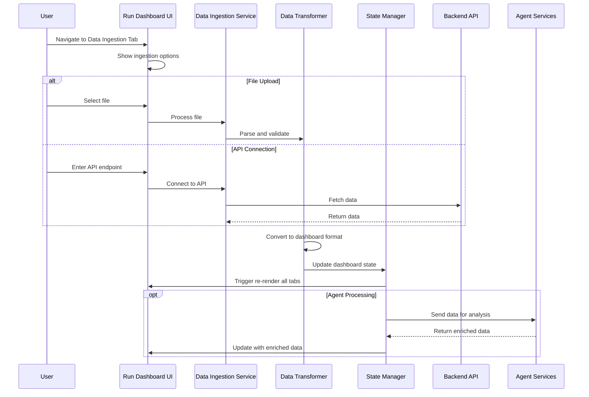

# Data Ingestion Workflow and State Management Plan

## Overview
This document outlines the data ingestion workflow and state management architecture for the seamless run dashboard experience.

## Data Ingestion Workflow

### 1. Ingestion Flow Diagram



### 2. Data Ingestion States

```typescript
enum IngestionState {
  IDLE = 'idle',
  VALIDATING = 'validating',
  PROCESSING = 'processing',
  TRANSFORMING = 'transforming',
  ENRICHING = 'enriching',
  COMPLETE = 'complete',
  ERROR = 'error'
}

interface IngestionProgress {
  state: IngestionState;
  progress: number; // 0-100
  message: string;
  details?: {
    totalRecords?: number;
    processedRecords?: number;
    errors?: string[];
    warnings?: string[];
  };
}
```

### 3. File Upload Workflow

```typescript
interface FileUploadWorkflow {
  // Step 1: File Validation
  validateFile(file: File): ValidationResult {
    - Check file type (CSV, JSON, Excel)
    - Verify file size (<10MB)
    - Check file structure
    - Return validation status
  }
  
  // Step 2: Parse File
  parseFile(file: File): ParsedData {
    - Read file content
    - Parse based on type
    - Extract data rows
    - Handle encoding issues
  }
  
  // Step 3: Data Validation
  validateData(data: ParsedData): DataValidation {
    - Check required fields
    - Validate data types
    - Verify data ranges
    - Flag anomalies
  }
  
  // Step 4: Transform Data
  transformData(data: ParsedData): DashboardData {
    - Map to dashboard schema
    - Calculate derived metrics
    - Generate time series
    - Aggregate by categories
  }
}
```

### 4. API Connection Workflow

```typescript
interface APIConnectionWorkflow {
  // Step 1: Endpoint Validation
  validateEndpoint(url: string): EndpointValidation {
    - Verify URL format
    - Check connectivity
    - Validate SSL certificate
    - Test authentication
  }
  
  // Step 2: Data Fetching
  fetchData(endpoint: APIEndpoint): Promise<APIData> {
    - Set request headers
    - Handle authentication
    - Implement retry logic
    - Stream large datasets
  }
  
  // Step 3: Response Processing
  processResponse(response: APIResponse): ProcessedData {
    - Handle pagination
    - Merge multiple responses
    - Transform API format
    - Handle errors gracefully
  }
}
```

## State Management Architecture

### 1. Global State Structure

```typescript
interface DashboardGlobalState {
  // Data State
  data: {
    source: 'demo' | 'ingested' | null;
    timestamp: string | null;
    raw: IngestedData | null;
    transformed: DashboardData | null;
    enriched: EnrichedData | null;
  };
  
  // Ingestion State
  ingestion: {
    status: IngestionState;
    progress: IngestionProgress;
    history: IngestionRecord[];
    currentSource: 'file' | 'api' | null;
  };
  
  // UI State
  ui: {
    activeTab: string;
    filters: FilterState;
    dateRange: DateRange;
    refreshInterval: number | null;
  };
  
  // Agent State
  agents: {
    processing: boolean;
    results: AgentResults | null;
    errors: AgentError[];
  };
  
  // Workflow State
  workflows: {
    available: Workflow[];
    executing: ExecutingWorkflow[];
    history: WorkflowExecution[];
  };
}
```

### 2. State Management Implementation

```typescript
// Using Zustand for state management
import { create } from 'zustand';
import { devtools, persist } from 'zustand/middleware';

interface DashboardStore extends DashboardGlobalState {
  // Actions
  setIngestionStatus: (status: IngestionState) => void;
  updateProgress: (progress: IngestionProgress) => void;
  setData: (data: DashboardData) => void;
  clearData: () => void;
  setActiveTab: (tab: string) => void;
  executeWorkflow: (workflowId: string) => Promise<void>;
}

export const useDashboardStore = create<DashboardStore>()(
  devtools(
    persist(
      (set, get) => ({
        // Initial state
        data: {
          source: null,
          timestamp: null,
          raw: null,
          transformed: null,
          enriched: null
        },
        
        // Actions
        setIngestionStatus: (status) => 
          set((state) => ({
            ingestion: { ...state.ingestion, status }
          })),
          
        updateProgress: (progress) =>
          set((state) => ({
            ingestion: { ...state.ingestion, progress }
          })),
          
        setData: (data) =>
          set((state) => ({
            data: {
              source: 'ingested',
              timestamp: new Date().toISOString(),
              transformed: data,
              raw: state.data.raw,
              enriched: state.data.enriched
            }
          })),
          
        clearData: () =>
          set(() => ({
            data: {
              source: null,
              timestamp: null,
              raw: null,
              transformed: null,
              enriched: null
            }
          })),
          
        // ... other actions
      }),
      {
        name: 'dashboard-storage',
        partialize: (state) => ({ 
          data: state.data,
          ui: state.ui 
        })
      }
    )
  )
);
```

### 3. Data Flow Management

```typescript
class DataFlowManager {
  private store: DashboardStore;
  private transformer: DataTransformer;
  private validator: DataValidator;
  
  async ingestData(source: DataSource): Promise<void> {
    try {
      // Update status
      this.store.setIngestionStatus(IngestionState.VALIDATING);
      
      // Validate source
      const validation = await this.validator.validate(source);
      if (!validation.isValid) {
        throw new ValidationError(validation.errors);
      }
      
      // Process data
      this.store.setIngestionStatus(IngestionState.PROCESSING);
      const rawData = await this.processSource(source);
      
      // Transform data
      this.store.setIngestionStatus(IngestionState.TRANSFORMING);
      const transformed = await this.transformer.transform(rawData);
      
      // Update store
      this.store.setData(transformed);
      this.store.setIngestionStatus(IngestionState.COMPLETE);
      
      // Trigger agent enrichment
      this.enrichWithAgents(transformed);
      
    } catch (error) {
      this.store.setIngestionStatus(IngestionState.ERROR);
      this.handleError(error);
    }
  }
  
  private async enrichWithAgents(data: DashboardData): Promise<void> {
    this.store.setIngestionStatus(IngestionState.ENRICHING);
    
    // Send to agent services
    const enriched = await this.agentService.analyze(data);
    
    // Update with enriched data
    this.store.setEnrichedData(enriched);
  }
}
```

### 4. Real-time Updates

```typescript
interface RealtimeUpdateManager {
  // WebSocket connection for live updates
  private ws: WebSocket;
  private reconnectAttempts: number = 0;
  
  connect(): void {
    this.ws = new WebSocket(WS_ENDPOINT);
    
    this.ws.onmessage = (event) => {
      const update = JSON.parse(event.data);
      this.handleUpdate(update);
    };
    
    this.ws.onerror = () => {
      this.reconnect();
    };
  }
  
  private handleUpdate(update: DataUpdate): void {
    switch (update.type) {
      case 'DATA_POINT':
        this.appendDataPoint(update.data);
        break;
      case 'METRIC_UPDATE':
        this.updateMetric(update.metric);
        break;
      case 'ALERT':
        this.showAlert(update.alert);
        break;
    }
  }
  
  private appendDataPoint(point: DataPoint): void {
    // Update time series data
    const currentData = this.store.getData();
    const updated = this.merger.appendPoint(currentData, point);
    this.store.setData(updated);
  }
}
```

### 5. Data Persistence Strategy

```typescript
interface DataPersistence {
  // Local Storage for quick access
  saveToLocal(data: DashboardData): void {
    const compressed = this.compress(data);
    localStorage.setItem('dashboard-data', compressed);
    localStorage.setItem('dashboard-timestamp', Date.now().toString());
  }
  
  // IndexedDB for larger datasets
  async saveToIndexedDB(data: DashboardData): Promise<void> {
    const db = await this.openDB();
    const tx = db.transaction('dashboard', 'readwrite');
    await tx.objectStore('dashboard').put({
      id: 'current',
      data: data,
      timestamp: Date.now()
    });
  }
  
  // Backend sync
  async syncToBackend(data: DashboardData): Promise<void> {
    await fetch('/api/dashboard/sync', {
      method: 'POST',
      body: JSON.stringify(data),
      headers: { 'Content-Type': 'application/json' }
    });
  }
}
```

### 6. Error Handling and Recovery

```typescript
class ErrorHandler {
  handleIngestionError(error: Error): void {
    // Categorize error
    const category = this.categorizeError(error);
    
    switch (category) {
      case 'VALIDATION':
        this.showValidationErrors(error);
        break;
      case 'PARSING':
        this.showParsingHelp(error);
        break;
      case 'NETWORK':
        this.retryWithBackoff(error);
        break;
      case 'TRANSFORMATION':
        this.showTransformationError(error);
        break;
    }
    
    // Log to audit system
    this.auditLogger.logError({
      type: 'INGESTION_ERROR',
      category,
      error: error.message,
      stack: error.stack,
      timestamp: new Date().toISOString()
    });
  }
  
  async recoverFromError(): Promise<void> {
    // Try to recover last good state
    const lastGoodState = await this.getLastGoodState();
    if (lastGoodState) {
      this.store.restoreState(lastGoodState);
      this.showRecoveryMessage();
    }
  }
}
```

## Integration Points

### 1. Backend API Integration

```typescript
interface BackendIntegration {
  // Data ingestion endpoint
  '/api/data/ingest': {
    method: 'POST';
    body: FormData | { endpoint: string };
    response: {
      jobId: string;
      status: 'queued' | 'processing';
    };
  };
  
  // Job status polling
  '/api/data/status/:jobId': {
    method: 'GET';
    response: {
      status: IngestionState;
      progress: number;
      result?: DashboardData;
      error?: string;
    };
  };
  
  // Data transformation
  '/api/data/transform': {
    method: 'POST';
    body: { data: any; targetFormat: string };
    response: DashboardData;
  };
}
```

### 2. Agent Service Integration

```typescript
interface AgentIntegration {
  // Send data for analysis
  analyzeData(data: DashboardData): Promise<EnrichedData>;
  
  // Subscribe to real-time insights
  subscribeToInsights(callback: (insight: Insight) => void): void;
  
  // Execute specific agent
  executeAgent(agentId: string, data: any): Promise<AgentResult>;
}
```

### 3. Workflow Integration

```typescript
interface WorkflowIntegration {
  // List available workflows
  getWorkflows(useCase: string): Promise<Workflow[]>;
  
  // Execute workflow
  executeWorkflow(workflowId: string, params: any): Promise<ExecutionResult>;
  
  // Monitor execution
  monitorExecution(executionId: string): Observable<ExecutionStatus>;
}
```

## Performance Considerations

1. **Chunked Processing**: Large files processed in chunks to avoid UI blocking
2. **Web Workers**: Heavy transformations run in background threads
3. **Memoization**: Cache transformed data to avoid recomputation
4. **Virtual Scrolling**: For large data tables
5. **Progressive Loading**: Load data as needed for visualizations
6. **Debounced Updates**: Batch state updates to reduce re-renders

## Security Considerations

1. **File Validation**: Strict validation of uploaded files
2. **API Authentication**: Secure token management for API connections
3. **Data Sanitization**: Clean all ingested data before processing
4. **Audit Logging**: Track all data operations
5. **Encryption**: Sensitive data encrypted in transit and at rest