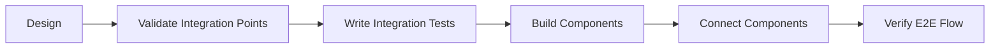

# Lessons Learned and Development Process Improvements

## Executive Summary

During the implementation of the Use Case Dashboard and its integration with Mission Control, we encountered a critical architectural failure that provides valuable lessons for future development. This document captures those lessons and proposes process improvements.

## What Happened

### The Problem
1. We built a Use Case Dashboard that correctly read from a persistence service
2. Mission Control was using local React state instead of the persistence service
3. The integration failed because the two components weren't connected
4. Users couldn't navigate between Mission Control and Use Case Dashboard without losing state

### Root Cause
- **Assumption without verification**: We assumed Mission Control would use our persistence service
- **Bottom-up development**: We built components before verifying integration points
- **Incomplete MVP definition**: Our MVP didn't include end-to-end integration

## Key Lessons Learned

### 1. Integration First, Components Second
**What we did**: Built Use Case Dashboard → Built Persistence → Tried to integrate
**What we should have done**: Verify integration → Build persistence → Build components

### 2. Test the Critical Path First
**The most important test**: Does data flow from point A to point B?
**Our mistake**: We tested components in isolation, not the complete flow

### 3. Validate All Assumptions
**Assumption**: "Mission Control will use our persistence service"
**Reality**: Mission Control had its own state management
**Lesson**: Always verify how existing components work

### 4. MVP Must Include Integration
**Wrong MVP**: Individual components working
**Right MVP**: End-to-end user journey working

## Process Improvements

### 1. Architectural Validation Checklist

Before starting implementation:
- [ ] Map all integration points
- [ ] Verify existing component behaviors
- [ ] Create end-to-end flow diagram
- [ ] Write integration tests first
- [ ] Validate assumptions with spike code

### 2. Development Workflow Changes



### 3. Definition of Done Updates

Add to all feature tickets:
- [ ] Integration points documented
- [ ] End-to-end tests passing
- [ ] No assumptions - all behaviors verified
- [ ] Architecture compliance validated

### 4. Technical Debt Management

When choosing between wrapper/quick fix vs proper refactoring:

**Document the decision**:
```markdown
## Technical Debt Record
- **What**: Mission Control persistence wrapper
- **Why**: Minimize risk, deliver quickly
- **Impact**: Extra event layer, not native integration
- **Remediation**: Refactor Mission Control to use persistence natively
- **Priority**: Medium
- **Estimated Effort**: 2 days
```

### 5. Architecture Compliance Testing

Create automated tests that verify architectural principles:

```typescript
describe('Architecture Compliance', () => {
  test('All dashboards use shared persistence', () => {
    // Verify Mission Control writes to persistence
    // Verify Use Case Dashboard reads from persistence
    // Verify state synchronization
  });
});
```

## Recommended Process Changes

### 1. Pre-Implementation Checklist

Before coding any feature that integrates with existing components:

1. **Spike Investigation** (2-4 hours)
   - How does the existing component work?
   - What state management does it use?
   - What are the integration points?

2. **Integration Design** (1-2 hours)
   - Draw data flow diagram
   - Identify all touchpoints
   - Plan the connection strategy

3. **Proof of Concept** (2-4 hours)
   - Minimal code to prove integration works
   - Validate all assumptions
   - Get early feedback

### 2. Phased Implementation

Replace our current approach with:

**Phase 1: Integration Skeleton**
- Connect the components with minimal functionality
- Verify data flows correctly
- Get early validation

**Phase 2: Feature Development**
- Build out the full functionality
- Add all the features
- Maintain integration tests

**Phase 3: Polish and Optimize**
- Improve performance
- Add nice-to-have features
- Refactor if needed

### 3. Documentation Requirements

Every integration must document:
- How components connect
- What data flows between them
- What assumptions were made
- How to test the integration

## Positive Outcomes

Despite the integration failure, several things went well:

1. **Component Quality**: The Use Case Dashboard components were well-built
2. **Persistence Service**: The service itself works perfectly
3. **Quick Recovery**: We identified and fixed the issue quickly
4. **Minimal Risk**: The wrapper solution got us working without breaking anything

## Action Items

1. **Update Development Guidelines**
   - Add integration-first approach
   - Require assumption validation
   - Mandate end-to-end testing

2. **Create Integration Template**
   - Standard checklist for integrations
   - Required documentation
   - Test templates

3. **Technical Debt Tracking**
   - Add Mission Control refactoring to backlog
   - Set up regular debt review meetings
   - Create debt remediation sprints

## Conclusion

This experience reinforced a fundamental principle: **Integration is not an afterthought, it's the foundation**. By building components in isolation, we created a perfect car with no roads to drive on. The wrapper solution got us moving, but the lesson is clear: always build the road first.

### The New Mantra

> "Test the integration, then build the components, not the other way around."

This failure was a valuable learning experience that will improve our development process going forward.