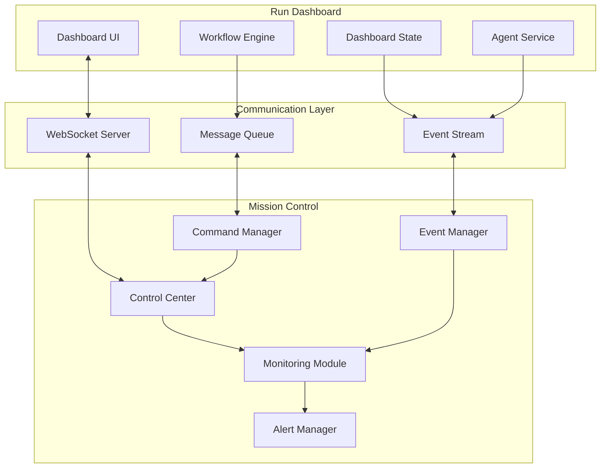
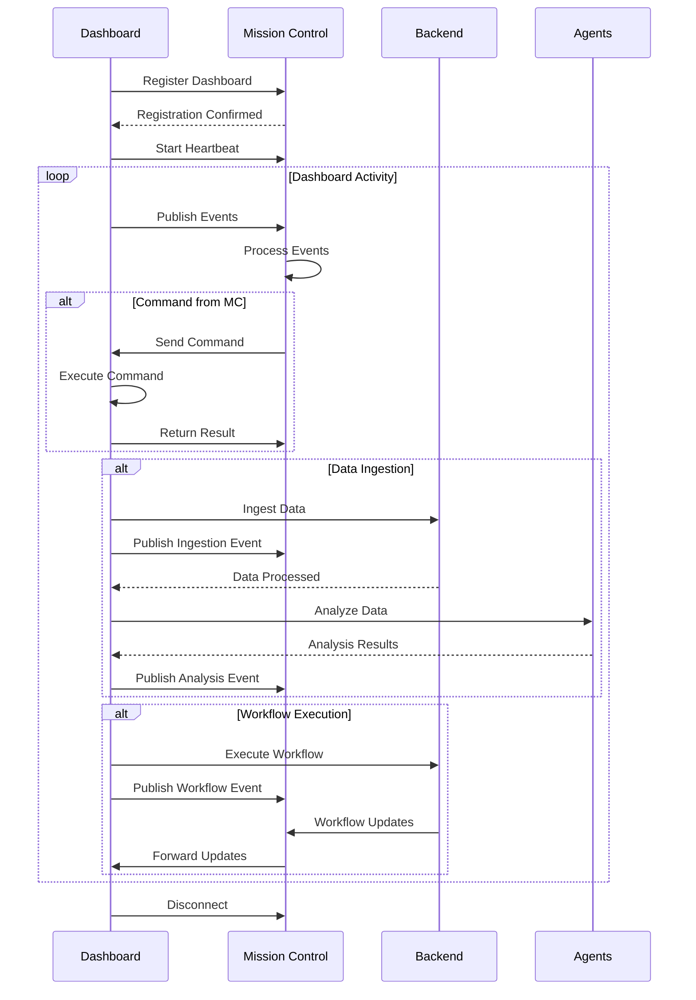

# Mission Control Integration Plan

## Overview
This document outlines how the run dashboard integrates with Mission Control to provide centralized monitoring, control, and coordination of all dashboard activities.

## Mission Control Architecture

### 1. Integration Overview



### 2. Mission Control Interface

```typescript
interface MissionControlInterface {
  // Dashboard Registration
  registerDashboard(config: DashboardConfig): Promise<RegistrationResult>;
  
  // Status Updates
  updateStatus(status: DashboardStatus): void;
  
  // Event Publishing
  publishEvent(event: DashboardEvent): void;
  
  // Command Handling
  onCommand(handler: CommandHandler): void;
  
  // Metric Reporting
  reportMetrics(metrics: DashboardMetrics): void;
  
  // Alert Management
  raiseAlert(alert: Alert): void;
  
  // Resource Monitoring
  reportResourceUsage(usage: ResourceUsage): void;
}

interface DashboardStatus {
  dashboardId: string;
  useCase: string;
  state: 'idle' | 'active' | 'processing' | 'error';
  dataStatus: {
    hasData: boolean;
    lastIngested: string | null;
    recordCount: number;
  };
  activeTab: string;
  connectedUsers: number;
  performance: {
    responseTime: number;
    errorRate: number;
    throughput: number;
  };
}
```

### 3. Mission Control Service Implementation

```typescript
// packages/frontend/src/services/missionControl.service.ts

export class MissionControlService {
  private ws: WebSocket;
  private dashboardId: string;
  private eventQueue: DashboardEvent[] = [];
  private commandHandlers: Map<string, CommandHandler> = new Map();
  private heartbeatInterval: NodeJS.Timer;
  
  constructor(private dashboardStore: DashboardStore) {
    this.dashboardId = generateDashboardId();
    this.connect();
    this.setupStoreSubscription();
  }
  
  // Connect to Mission Control
  private async connect(): Promise<void> {
    this.ws = new WebSocket(MISSION_CONTROL_WS_URL);
    
    this.ws.onopen = async () => {
      // Register dashboard
      await this.registerDashboard();
      
      // Start heartbeat
      this.startHeartbeat();
      
      // Flush event queue
      this.flushEventQueue();
    };
    
    this.ws.onmessage = (event) => {
      const message = JSON.parse(event.data);
      this.handleMissionControlMessage(message);
    };
    
    this.ws.onerror = (error) => {
      console.error('Mission Control connection error:', error);
      this.reconnect();
    };
  }
  
  // Register dashboard with Mission Control
  private async registerDashboard(): Promise<void> {
    const config: DashboardConfig = {
      id: this.dashboardId,
      type: 'run-dashboard',
      useCase: this.dashboardStore.getUseCase(),
      version: APP_VERSION,
      capabilities: [
        'data-ingestion',
        'agent-execution',
        'workflow-deployment',
        'real-time-updates'
      ],
      metadata: {
        user: getCurrentUser(),
        environment: getEnvironment(),
        startTime: new Date().toISOString()
      }
    };
    
    const registration = await this.sendCommand('register', config);
    
    if (registration.success) {
      console.log('Dashboard registered with Mission Control');
      this.setupCommandHandlers();
    }
  }
  
  // Setup store subscription for automatic updates
  private setupStoreSubscription(): void {
    // Subscribe to state changes
    this.dashboardStore.subscribe((state, prevState) => {
      // Detect significant changes
      if (this.hasSignificantChange(state, prevState)) {
        this.updateStatus(this.buildStatus(state));
      }
      
      // Publish events for specific changes
      if (state.data.source !== prevState.data.source) {
        this.publishEvent({
          type: 'DATA_SOURCE_CHANGED',
          payload: {
            from: prevState.data.source,
            to: state.data.source,
            timestamp: new Date().toISOString()
          }
        });
      }
      
      if (state.ingestion.status !== prevState.ingestion.status) {
        this.publishEvent({
          type: 'INGESTION_STATUS_CHANGED',
          payload: {
            status: state.ingestion.status,
            progress: state.ingestion.progress
          }
        });
      }
    });
  }
  
  // Handle commands from Mission Control
  private handleMissionControlMessage(message: MissionControlMessage): void {
    switch (message.type) {
      case 'COMMAND':
        this.executeCommand(message.command);
        break;
        
      case 'QUERY':
        this.handleQuery(message.query);
        break;
        
      case 'ALERT':
        this.displayAlert(message.alert);
        break;
        
      case 'CONFIG_UPDATE':
        this.updateConfiguration(message.config);
        break;
    }
  }
  
  // Execute command from Mission Control
  private async executeCommand(command: Command): Promise<void> {
    const handler = this.commandHandlers.get(command.type);
    
    if (!handler) {
      console.warn(`No handler for command type: ${command.type}`);
      return;
    }
    
    try {
      const result = await handler(command);
      
      // Send result back to Mission Control
      this.sendCommandResult({
        commandId: command.id,
        success: true,
        result: result
      });
      
    } catch (error) {
      this.sendCommandResult({
        commandId: command.id,
        success: false,
        error: error.message
      });
    }
  }
  
  // Setup command handlers
  private setupCommandHandlers(): void {
    // Data ingestion commands
    this.commandHandlers.set('INGEST_DATA', async (cmd) => {
      const { source, params } = cmd.payload;
      return await this.dashboardStore.ingestData(source, params);
    });
    
    // Workflow execution commands
    this.commandHandlers.set('EXECUTE_WORKFLOW', async (cmd) => {
      const { workflowId, context } = cmd.payload;
      return await workflowService.executeWorkflow({ workflowId, ...context });
    });
    
    // Tab navigation commands
    this.commandHandlers.set('NAVIGATE_TAB', (cmd) => {
      const { tabId } = cmd.payload;
      this.dashboardStore.setActiveTab(tabId);
      return { success: true, tab: tabId };
    });
    
    // Data refresh commands
    this.commandHandlers.set('REFRESH_DATA', async (cmd) => {
      await this.dashboardStore.refreshData();
      return { success: true, timestamp: new Date().toISOString() };
    });
    
    // Export commands
    this.commandHandlers.set('EXPORT_DATA', async (cmd) => {
      const { format } = cmd.payload;
      const data = await this.dashboardStore.exportData(format);
      return { success: true, data };
    });
  }
}
```

### 4. Mission Control Dashboard Component

```typescript
// Mission Control status indicator in dashboard
export const MissionControlStatus: React.FC = () => {
  const [connected, setConnected] = useState(false);
  const [lastCommand, setLastCommand] = useState<Command | null>(null);
  const [metrics, setMetrics] = useState<DashboardMetrics | null>(null);
  
  useEffect(() => {
    const mc = missionControlService;
    
    // Subscribe to connection status
    mc.onConnectionChange((status) => {
      setConnected(status === 'connected');
    });
    
    // Subscribe to commands
    mc.onCommand((command) => {
      setLastCommand(command);
    });
    
    // Subscribe to metrics
    const interval = setInterval(() => {
      setMetrics(mc.getMetrics());
    }, 5000);
    
    return () => clearInterval(interval);
  }, []);
  
  return (
    <div className="mission-control-status">
      <div className="flex items-center space-x-2">
        <div className={`w-2 h-2 rounded-full ${
          connected ? 'bg-green-500' : 'bg-red-500'
        }`} />
        <span className="text-sm text-gray-400">
          Mission Control {connected ? 'Connected' : 'Disconnected'}
        </span>
      </div>
      
      {lastCommand && (
        <div className="mt-2 text-xs text-gray-500">
          Last Command: {lastCommand.type} ({formatTime(lastCommand.timestamp)})
        </div>
      )}
      
      {metrics && (
        <div className="mt-2 grid grid-cols-3 gap-2 text-xs">
          <div>
            <span className="text-gray-500">Events:</span>
            <span className="ml-1 text-white">{metrics.eventCount}</span>
          </div>
          <div>
            <span className="text-gray-500">Errors:</span>
            <span className="ml-1 text-white">{metrics.errorCount}</span>
          </div>
          <div>
            <span className="text-gray-500">Uptime:</span>
            <span className="ml-1 text-white">{metrics.uptime}</span>
          </div>
        </div>
      )}
    </div>
  );
};
```

### 5. Event Publishing System

```typescript
interface EventPublisher {
  // Publish dashboard events to Mission Control
  publishEvent(event: DashboardEvent): void {
    // Add metadata
    const enrichedEvent: EnrichedEvent = {
      ...event,
      dashboardId: this.dashboardId,
      timestamp: new Date().toISOString(),
      context: {
        useCase: this.dashboardStore.getUseCase(),
        user: getCurrentUser(),
        sessionId: getSessionId()
      }
    };
    
    // Queue if not connected
    if (!this.isConnected()) {
      this.eventQueue.push(enrichedEvent);
      return;
    }
    
    // Send immediately
    this.sendEvent(enrichedEvent);
  }
  
  // Event types
  publishDataIngested(data: IngestedData): void {
    this.publishEvent({
      type: 'DATA_INGESTED',
      severity: 'info',
      payload: {
        source: data.source,
        recordCount: data.records.length,
        timestamp: data.timestamp,
        quality: data.qualityScore
      }
    });
  }
  
  publishWorkflowStarted(workflow: WorkflowExecution): void {
    this.publishEvent({
      type: 'WORKFLOW_STARTED',
      severity: 'info',
      payload: {
        workflowId: workflow.id,
        name: workflow.name,
        startTime: workflow.startTime
      }
    });
  }
  
  publishAgentResult(agent: string, result: AgentResult): void {
    this.publishEvent({
      type: 'AGENT_RESULT',
      severity: result.success ? 'info' : 'warning',
      payload: {
        agent,
        success: result.success,
        score: result.score,
        insights: result.insights.length
      }
    });
  }
  
  publishError(error: Error, context: any): void {
    this.publishEvent({
      type: 'ERROR',
      severity: 'error',
      payload: {
        message: error.message,
        stack: error.stack,
        context
      }
    });
  }
}
```

### 6. Mission Control Integration Flow



### 7. Monitoring and Metrics

```typescript
interface DashboardMetrics {
  // Performance metrics
  performance: {
    pageLoadTime: number;
    apiResponseTime: number;
    renderTime: number;
    memoryUsage: number;
    cpuUsage: number;
  };
  
  // Usage metrics
  usage: {
    activeUsers: number;
    sessionDuration: number;
    tabViews: Record<string, number>;
    featureUsage: Record<string, number>;
  };
  
  // Data metrics
  data: {
    totalRecords: number;
    processingRate: number;
    errorRate: number;
    dataQuality: number;
  };
  
  // Agent metrics
  agents: {
    executionCount: number;
    avgExecutionTime: number;
    successRate: number;
    queueLength: number;
  };
  
  // Workflow metrics
  workflows: {
    activeCount: number;
    completedCount: number;
    failedCount: number;
    avgDuration: number;
  };
}

// Metric collection service
class MetricCollector {
  private metrics: DashboardMetrics;
  private collectors: MetricCollector[] = [];
  
  constructor() {
    this.setupCollectors();
    this.startCollection();
  }
  
  private setupCollectors(): void {
    // Performance collector
    this.collectors.push({
      name: 'performance',
      interval: 5000,
      collect: () => ({
        pageLoadTime: performance.timing.loadEventEnd - performance.timing.navigationStart,
        apiResponseTime: this.getAvgApiResponseTime(),
        renderTime: this.getAvgRenderTime(),
        memoryUsage: (performance as any).memory?.usedJSHeapSize || 0,
        cpuUsage: this.estimateCPUUsage()
      })
    });
    
    // Usage collector
    this.collectors.push({
      name: 'usage',
      interval: 10000,
      collect: () => ({
        activeUsers: this.getActiveUserCount(),
        sessionDuration: this.getSessionDuration(),
        tabViews: this.getTabViewCounts(),
        featureUsage: this.getFeatureUsageCounts()
      })
    });
  }
  
  // Send metrics to Mission Control
  private sendMetrics(): void {
    missionControlService.reportMetrics(this.metrics);
  }
}
```

### 8. Alert Integration

```typescript
interface AlertIntegration {
  // Raise alerts to Mission Control
  raiseAlert(alert: Alert): void {
    const enrichedAlert: EnrichedAlert = {
      ...alert,
      source: 'dashboard',
      dashboardId: this.dashboardId,
      context: this.getCurrentContext(),
      timestamp: new Date().toISOString()
    };
    
    // Send to Mission Control
    this.missionControl.raiseAlert(enrichedAlert);
    
    // Also show locally
    this.showLocalAlert(alert);
  }
  
  // Alert types
  alertDataQualityIssue(quality: number): void {
    if (quality < QUALITY_THRESHOLD) {
      this.raiseAlert({
        type: 'DATA_QUALITY',
        severity: 'warning',
        title: 'Data Quality Below Threshold',
        message: `Data quality score: ${quality}%. Review data ingestion.`,
        actions: [
          { label: 'View Details', action: 'VIEW_DATA_QUALITY' },
          { label: 'Re-ingest', action: 'REINGEST_DATA' }
        ]
      });
    }
  }
  
  alertWorkflowFailure(workflow: WorkflowExecution): void {
    this.raiseAlert({
      type: 'WORKFLOW_FAILURE',
      severity: 'error',
      title: 'Workflow Execution Failed',
      message: `Workflow "${workflow.name}" failed: ${workflow.error}`,
      actions: [
        { label: 'View Logs', action: 'VIEW_WORKFLOW_LOGS' },
        { label: 'Retry', action: 'RETRY_WORKFLOW' }
      ]
    });
  }
}
```

### 9. Remote Control Capabilities

```typescript
interface RemoteControl {
  // Commands that can be executed from Mission Control
  commands: {
    // Data management
    'CLEAR_DATA': () => void;
    'REFRESH_DATA': () => Promise<void>;
    'EXPORT_DATA': (format: string) => Promise<Blob>;
    
    // Navigation
    'NAVIGATE_TAB': (tabId: string) => void;
    'OPEN_MODAL': (modalId: string) => void;
    'CLOSE_ALL_MODALS': () => void;
    
    // Workflow control
    'START_WORKFLOW': (workflowId: string) => Promise<void>;
    'STOP_WORKFLOW': (executionId: string) => Promise<void>;
    'PAUSE_WORKFLOW': (executionId: string) => Promise<void>;
    
    // Agent control
    'EXECUTE_AGENT': (agentId: string, data: any) => Promise<void>;
    'CANCEL_AGENT': (executionId: string) => Promise<void>;
    
    // System control
    'ENABLE_DEBUG_MODE': () => void;
    'DISABLE_DEBUG_MODE': () => void;
    'COLLECT_DIAGNOSTICS': () => Promise<DiagnosticData>;
    'RESTART_SERVICES': () => Promise<void>;
  };
}
```

### 10. Security and Access Control

```typescript
interface SecurityIntegration {
  // Verify command authorization
  async authorizeCommand(command: Command): Promise<boolean> {
    // Check command signature
    if (!this.verifySignature(command)) {
      console.error('Invalid command signature');
      return false;
    }
    
    // Check user permissions
    const user = getCurrentUser();
    const hasPermission = await this.checkPermission(user, command.type);
    
    if (!hasPermission) {
      this.auditLog.logUnauthorizedAccess(user, command);
      return false;
    }
    
    // Check rate limits
    if (this.isRateLimited(command.type)) {
      return false;
    }
    
    return true;
  }
  
  // Encrypt sensitive data
  encryptPayload(payload: any): string {
    return this.crypto.encrypt(JSON.stringify(payload), MISSION_CONTROL_KEY);
  }
  
  // Audit logging
  logCommandExecution(command: Command, result: any): void {
    this.auditLog.log({
      type: 'MISSION_CONTROL_COMMAND',
      command: command.type,
      user: getCurrentUser(),
      timestamp: new Date().toISOString(),
      success: result.success,
      duration: result.duration
    });
  }
}
```

## Benefits of Mission Control Integration

1. **Centralized Monitoring**: View all dashboard activities from a single control center
2. **Remote Management**: Control dashboards remotely without direct access
3. **Coordinated Operations**: Orchestrate multiple dashboards for complex operations
4. **Real-time Visibility**: See live status and metrics from all dashboards
5. **Proactive Alerting**: Receive alerts before issues impact users
6. **Audit Trail**: Complete record of all dashboard activities
7. **Performance Optimization**: Identify and resolve performance bottlenecks
8. **Security Enhancement**: Centralized security monitoring and control