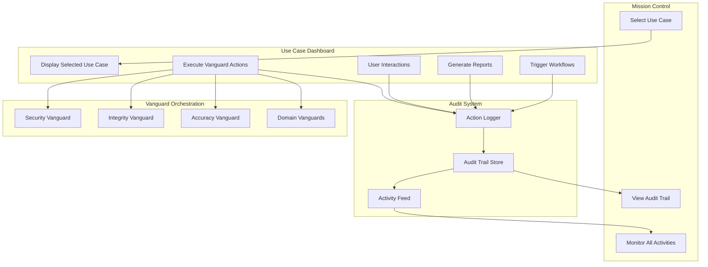

# Use Case Dashboard Architecture (Revised)

## Core Principles - Updated Understanding

### What Users CAN Do in Use Case Dashboard:
1. **Execute Vanguard Agent Actions** - Run analyses, optimizations, predictions
2. **Interact with Data** - Filter, sort, drill down into details
3. **Trigger Workflows** - Initiate renewal processes, generate reports
4. **Make Decisions** - Approve/reject recommendations, set parameters
5. **Monitor Real-time Updates** - View live data, agent activities

### What Users CANNOT Do in Use Case Dashboard:
1. **Change the Selected Use Case** - Must return to Mission Control to select a different use case
2. **Access Other Use Cases** - Dashboard is locked to the selected use case

### Audit Trail Integration
All actions taken in the Use Case Dashboard are logged to the Mission Control audit trail:
- Vanguard agent executions
- User-initiated workflows
- Data modifications
- Report generations
- Decision points

## Updated Architecture Flow



## Action Logging Architecture

### Action Types to Log

```typescript
enum ActionType {
  // Vanguard Actions
  VANGUARD_EXECUTION = 'vanguard_execution',
  VANGUARD_RESULT = 'vanguard_result',
  
  // Data Actions
  DATA_EXPORT = 'data_export',
  DATA_FILTER = 'data_filter',
  DATA_UPDATE = 'data_update',
  
  // Workflow Actions
  WORKFLOW_INITIATED = 'workflow_initiated',
  WORKFLOW_COMPLETED = 'workflow_completed',
  WORKFLOW_FAILED = 'workflow_failed',
  
  // Decision Actions
  RECOMMENDATION_APPROVED = 'recommendation_approved',
  RECOMMENDATION_REJECTED = 'recommendation_rejected',
  PARAMETER_CHANGED = 'parameter_changed',
  
  // Report Actions
  REPORT_GENERATED = 'report_generated',
  REPORT_EXPORTED = 'report_exported'
}

interface AuditLogEntry {
  id: string;
  timestamp: Date;
  userId: string;
  useCaseId: string;
  actionType: ActionType;
  actionDetails: {
    component: string;
    description: string;
    parameters?: Record<string, any>;
    result?: any;
    duration?: number;
  };
  metadata: {
    ipAddress: string;
    userAgent: string;
    sessionId: string;
  };
}
```

### Audit Service Integration

```typescript
// In Use Case Dashboard components
import { useAuditLogger } from '@/hooks/useAuditLogger';

const LeaseRenewalComponent = () => {
  const { logAction } = useAuditLogger();
  const { executeVanguard } = useVanguardOrchestrator();
  
  const handleRenewalAnalysis = async (leaseId: string) => {
    // Log the action initiation
    const actionId = await logAction({
      actionType: ActionType.VANGUARD_EXECUTION,
      actionDetails: {
        component: 'LeaseRenewalComponent',
        description: 'Initiated renewal analysis for lease',
        parameters: { leaseId, vanguard: 'negotiation-vanguard' }
      }
    });
    
    try {
      // Execute the vanguard action
      const result = await executeVanguard('negotiation-vanguard', {
        action: 'analyze-renewal',
        leaseId
      });
      
      // Log the successful result
      await logAction({
        actionType: ActionType.VANGUARD_RESULT,
        actionDetails: {
          component: 'LeaseRenewalComponent',
          description: 'Renewal analysis completed',
          parameters: { leaseId },
          result: result.summary,
          duration: result.executionTime
        }
      });
      
      return result;
    } catch (error) {
      // Log the failure
      await logAction({
        actionType: ActionType.WORKFLOW_FAILED,
        actionDetails: {
          component: 'LeaseRenewalComponent',
          description: 'Renewal analysis failed',
          parameters: { leaseId },
          result: { error: error.message }
        }
      });
      throw error;
    }
  };
};
```

## Oilfield Land Lease - Actionable Features

### 1. Vanguard Agent Actions

```typescript
interface VanguardActions {
  // Accuracy Vanguard
  'validate-lease-data': {
    description: 'Validate lease data against CLM and public records';
    parameters: { leaseIds: string[] };
    output: ValidationReport;
  };
  
  // Negotiation Vanguard
  'analyze-renewal-terms': {
    description: 'Analyze market rates and recommend renewal terms';
    parameters: { leaseId: string; marketData?: boolean };
    output: RenewalRecommendation;
  };
  
  // Optimization Vanguard
  'optimize-portfolio': {
    description: 'Optimize lease portfolio for maximum ROI';
    parameters: { constraints: PortfolioConstraints };
    output: OptimizationPlan;
  };
  
  // Security Vanguard
  'audit-compliance': {
    description: 'Audit lease compliance with regulations';
    parameters: { leaseIds: string[]; regulations: string[] };
    output: ComplianceReport;
  };
}
```

### 2. User-Triggered Workflows

```typescript
interface UserWorkflows {
  'initiate-renewal': {
    steps: [
      'gather-lease-data',
      'run-market-analysis',
      'generate-renewal-package',
      'submit-for-approval'
    ];
    requiredApprovals: ['legal', 'finance'];
  };
  
  'bulk-update-terms': {
    steps: [
      'validate-selections',
      'apply-updates',
      'notify-stakeholders',
      'update-systems'
    ];
    auditRequired: true;
  };
  
  'generate-executive-report': {
    steps: [
      'aggregate-data',
      'run-analytics',
      'create-visualizations',
      'compile-pdf'
    ];
    schedule: 'on-demand' | 'weekly' | 'monthly';
  };
}
```

### 3. Real-time Monitoring Actions

```typescript
interface MonitoringActions {
  'set-alert-threshold': {
    description: 'Set custom alert thresholds for lease expiration';
    parameters: {
      daysBeforeExpiration: number;
      minimumValue?: number;
      notificationChannels: string[];
    };
  };
  
  'subscribe-to-updates': {
    description: 'Subscribe to real-time updates for specific leases';
    parameters: {
      leaseIds: string[];
      updateTypes: ('status' | 'compliance' | 'market')[];
    };
  };
}
```

## Updated Component Structure

```
UseCaseDashboard/
├── components/
│   ├── ActionBar.tsx              # Common action buttons
│   ├── AuditLogger.tsx           # Audit logging wrapper
│   └── templates/
│       └── oilfield-land-lease/
│           ├── actions/          # Action components
│           │   ├── VanguardActions.tsx
│           │   ├── WorkflowTriggers.tsx
│           │   └── QuickActions.tsx
│           ├── panels/           # Display panels
│           │   ├── LeaseGrid.tsx
│           │   ├── ComplianceMonitor.tsx
│           │   ├── RenewalPipeline.tsx
│           │   └── MarketAnalytics.tsx
│           └── modals/           # Action modals
│               ├── RenewalWizard.tsx
│               ├── BulkUpdateModal.tsx
│               └── ReportGenerator.tsx
```

## Implementation Example - Vanguard Action Button

```typescript
// VanguardActionButton.tsx
import React, { useState } from 'react';
import { SparklesIcon } from '@heroicons/react/24/outline';
import { useAuditLogger } from '@/hooks/useAuditLogger';
import { useVanguardOrchestrator } from '@/hooks/useVanguardOrchestrator';
import { toast } from 'react-hot-toast';

interface VanguardActionButtonProps {
  leaseId: string;
  vanguardType: 'accuracy' | 'negotiation' | 'optimization';
  action: string;
  label: string;
  onComplete?: (result: any) => void;
}

export const VanguardActionButton: React.FC<VanguardActionButtonProps> = ({
  leaseId,
  vanguardType,
  action,
  label,
  onComplete
}) => {
  const [loading, setLoading] = useState(false);
  const { logAction } = useAuditLogger();
  const { executeVanguard } = useVanguardOrchestrator();
  
  const handleClick = async () => {
    setLoading(true);
    
    // Log action initiation
    await logAction({
      actionType: ActionType.VANGUARD_EXECUTION,
      actionDetails: {
        component: 'VanguardActionButton',
        description: `Executing ${vanguardType} vanguard: ${action}`,
        parameters: { leaseId, vanguardType, action }
      }
    });
    
    try {
      const result = await executeVanguard(vanguardType, {
        action,
        leaseId
      });
      
      // Log success
      await logAction({
        actionType: ActionType.VANGUARD_RESULT,
        actionDetails: {
          component: 'VanguardActionButton',
          description: `${vanguardType} vanguard completed successfully`,
          result: result.summary
        }
      });
      
      toast.success(`${label} completed successfully`);
      onComplete?.(result);
    } catch (error) {
      // Log failure
      await logAction({
        actionType: ActionType.WORKFLOW_FAILED,
        actionDetails: {
          component: 'VanguardActionButton',
          description: `${vanguardType} vanguard failed`,
          result: { error: error.message }
        }
      });
      
      toast.error(`Failed to ${label}`);
    } finally {
      setLoading(false);
    }
  };
  
  return (
    <button
      onClick={handleClick}
      disabled={loading}
      className="flex items-center gap-2 px-4 py-2 bg-amber-600 hover:bg-amber-700 
                 text-white rounded-lg transition-colors disabled:opacity-50"
    >
      <SparklesIcon className={`w-5 h-5 ${loading ? 'animate-pulse' : ''}`} />
      {loading ? 'Processing...' : label}
    </button>
  );
};
```

## Key Architecture Updates

1. **Action-Oriented Design**: The Use Case Dashboard is now designed around actions users can take, not just data display

2. **Comprehensive Audit Trail**: Every action is logged with full context for Mission Control visibility

3. **Vanguard Integration**: Deep integration with Vanguard agents for automated analysis and recommendations

4. **Workflow Orchestration**: Support for complex multi-step workflows with approval chains

5. **Real-time Feedback**: Actions provide immediate feedback while logging to audit trail

6. **Permission-Based Actions**: Actions can be gated by user roles and permissions

## Next Steps

1. Implement the audit logging infrastructure
2. Create the action-oriented UI components
3. Build the Vanguard orchestration layer
4. Integrate with Mission Control's audit trail
5. Add real-time WebSocket updates for action status