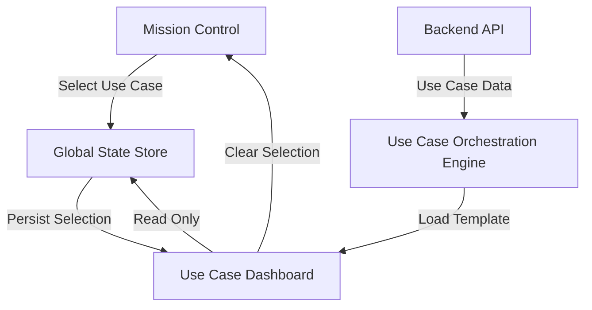
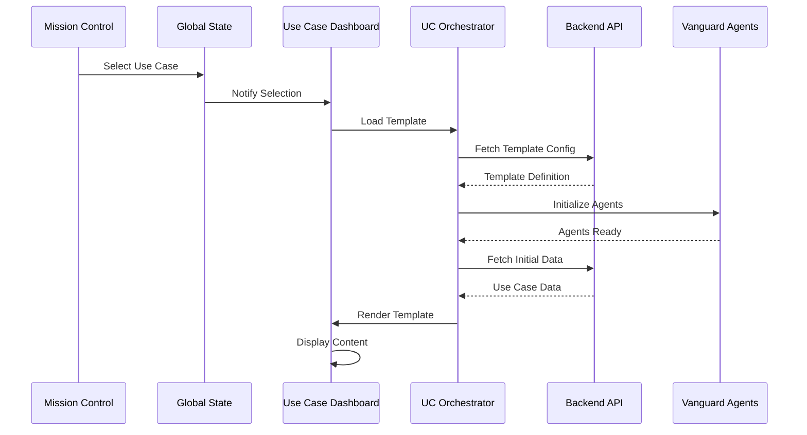

# Use Case Dashboard Architecture

## Overview

The Use Case Dashboard follows the same architectural principles as Mission Control:
- Starts blank/empty until a use case is selected
- Content is dynamically loaded based on the selected use case from Mission Control
- Cannot change the use case from within the dashboard - must go back to Mission Control
- Each use case has pre-configured templates managed by the Use Case Orchestration Engine

## Core Principles

### 1. State Management Flow



### 2. Component Architecture

```
UseCaseDashboard/
├── index.tsx                    # Main container (blank state + router)
├── components/
│   ├── BlankState.tsx          # Shows when no use case selected
│   ├── DashboardHeader.tsx     # Shows selected use case info
│   ├── UseCaseRenderer.tsx     # Dynamically renders use case content
│   └── common/                 # Shared components across use cases
│       ├── MetricsCard.tsx
│       ├── DataGrid.tsx
│       ├── ChartContainer.tsx
│       └── ActionPanel.tsx
├── templates/                   # Use case specific templates
│   ├── energy/
│   │   └── OilfieldLandLease/
│   │       ├── index.tsx
│   │       ├── components/
│   │       │   ├── LeaseGrid.tsx
│   │       │   ├── LeaseMap.tsx
│   │       │   ├── ExpirationTracker.tsx
│   │       │   ├── RenewalAnalytics.tsx
│   │       │   └── ComplianceMonitor.tsx
│   │       └── config.ts
│   ├── healthcare/
│   ├── finance/
│   └── [other-verticals]/
└── orchestration/
    ├── UseCaseOrchestrator.ts
    ├── TemplateRegistry.ts
    └── DataPipeline.ts
```

### 3. Use Case Orchestration Engine

```typescript
interface UseCaseTemplate {
  id: string;
  vertical: string;
  name: string;
  version: string;
  
  // Layout configuration
  layout: {
    type: 'grid' | 'tabs' | 'wizard' | 'custom';
    sections: Section[];
  };
  
  // Data requirements
  dataRequirements: {
    sources: DataSource[];
    refreshInterval?: number;
    cacheStrategy?: 'none' | 'session' | 'persistent';
  };
  
  // Vanguard agents configuration
  agents: {
    required: string[];
    optional: string[];
    orchestration: AgentOrchestration[];
  };
  
  // Analytics and monitoring
  analytics: {
    kpis: KPI[];
    alerts: AlertConfig[];
    reports: ReportConfig[];
  };
  
  // Actions and workflows
  actions: {
    primary: Action[];
    contextual: Action[];
    automated: AutomatedAction[];
  };
}

interface Section {
  id: string;
  title: string;
  type: 'metrics' | 'grid' | 'chart' | 'map' | 'timeline' | 'custom';
  component: string; // Component path
  props?: Record<string, any>;
  dataBinding?: DataBinding;
  visibility?: VisibilityRule;
  interactions?: Interaction[];
}
```

### 4. State Management

```typescript
// Global state shared between Mission Control and Use Case Dashboard
interface MissionControlState {
  selectedVertical: string | null;
  selectedUseCase: string | null;
  selectedUseCaseDetails: UseCaseDetails | null;
  useCaseData: any | null;
  executionHistory: ExecutionRecord[];
  currentStep: string | null;
}

// Use Case Dashboard specific state
interface UseCaseDashboardState {
  template: UseCaseTemplate | null;
  sections: Record<string, SectionState>;
  data: Record<string, any>;
  filters: Record<string, any>;
  selectedItems: string[];
  viewMode: 'overview' | 'detail' | 'analytics';
}
```

### 5. Data Flow Architecture



## Oilfield Land Lease Use Case Template

### Sections from Use Case Launcher OLD

Based on the UseCaseLauncher analysis, the Oilfield Land Lease use case should include:

1. **Executive Overview**
   - Pain points visualization
   - Business case metrics
   - ROI calculator
   - Industry reference cases

2. **Lease Portfolio Management**
   - Lease status grid with filtering
   - Expiration timeline
   - Geographic map view
   - Operator analysis

3. **Compliance & Risk**
   - SIA (Security, Integrity, Accuracy) scores
   - Regulatory compliance tracker
   - Risk heat map
   - Audit trail

4. **Financial Analytics**
   - Portfolio valuation
   - Revenue optimization
   - Cost analysis
   - Market comparisons

5. **Vanguard Agent Actions**
   - Automated renewal recommendations
   - Market rate analysis
   - Risk predictions
   - Optimization suggestions

6. **Operational Workflows**
   - Renewal pipeline
   - Document management
   - Approval workflows
   - Integration status

### Template Configuration

```typescript
const oilfieldLandLeaseTemplate: UseCaseTemplate = {
  id: 'energy-oilfield-land-lease',
  vertical: 'energy',
  name: 'Oilfield Land Lease Management',
  version: '1.0.0',
  
  layout: {
    type: 'tabs',
    sections: [
      {
        id: 'overview',
        title: 'Executive Overview',
        type: 'custom',
        component: 'energy/OilfieldLandLease/ExecutiveOverview',
        dataBinding: {
          sources: ['portfolio-summary', 'market-data', 'roi-metrics']
        }
      },
      {
        id: 'portfolio',
        title: 'Lease Portfolio',
        type: 'custom',
        component: 'energy/OilfieldLandLease/LeasePortfolio',
        props: {
          enableMap: true,
          enableGrid: true,
          enableAnalytics: true
        }
      },
      {
        id: 'compliance',
        title: 'Compliance & Risk',
        type: 'custom',
        component: 'energy/OilfieldLandLease/ComplianceRisk',
        dataBinding: {
          sources: ['compliance-scores', 'risk-assessments', 'audit-logs']
        }
      },
      {
        id: 'financials',
        title: 'Financial Analytics',
        type: 'custom',
        component: 'energy/OilfieldLandLease/FinancialAnalytics'
      },
      {
        id: 'vanguard',
        title: 'AI Vanguard Actions',
        type: 'custom',
        component: 'energy/OilfieldLandLease/VanguardActions'
      },
      {
        id: 'workflows',
        title: 'Workflows',
        type: 'custom',
        component: 'energy/OilfieldLandLease/Workflows'
      }
    ]
  },
  
  dataRequirements: {
    sources: [
      {
        id: 'lease-data',
        type: 'api',
        endpoint: '/api/usecases/energy-oilfield-land-lease/leases',
        refreshInterval: 300000 // 5 minutes
      },
      {
        id: 'market-data',
        type: 'api',
        endpoint: '/api/usecases/energy-oilfield-land-lease/market',
        refreshInterval: 3600000 // 1 hour
      },
      {
        id: 'compliance-data',
        type: 'api',
        endpoint: '/api/usecases/energy-oilfield-land-lease/compliance',
        refreshInterval: 600000 // 10 minutes
      }
    ],
    cacheStrategy: 'session'
  },
  
  agents: {
    required: ['accuracy-vanguard', 'negotiation-vanguard', 'optimization-vanguard'],
    optional: ['security-vanguard', 'integrity-vanguard'],
    orchestration: [
      {
        trigger: 'lease-expiration-90-days',
        agents: ['negotiation-vanguard', 'optimization-vanguard'],
        workflow: 'renewal-analysis'
      }
    ]
  },
  
  analytics: {
    kpis: [
      {
        id: 'total-leases',
        name: 'Total Leases',
        calculation: 'count',
        target: 1500
      },
      {
        id: 'portfolio-value',
        name: 'Portfolio Value',
        calculation: 'sum',
        field: 'value',
        format: 'currency'
      },
      {
        id: 'expiring-soon',
        name: 'Expiring in 90 Days',
        calculation: 'count',
        filter: 'daysUntilExpiration <= 90',
        alertThreshold: 50
      }
    ],
    alerts: [
      {
        id: 'critical-expiration',
        name: 'Critical Lease Expiration',
        condition: 'daysUntilExpiration <= 30 && value > 1000000',
        severity: 'critical',
        notification: 'immediate'
      }
    ]
  },
  
  actions: {
    primary: [
      {
        id: 'run-renewal-analysis',
        label: 'Run Renewal Analysis',
        icon: 'SparklesIcon',
        handler: 'runRenewalAnalysis'
      },
      {
        id: 'generate-report',
        label: 'Generate Report',
        icon: 'DocumentTextIcon',
        handler: 'generateReport'
      }
    ],
    contextual: [
      {
        id: 'view-lease-details',
        label: 'View Details',
        context: 'lease-item',
        handler: 'viewLeaseDetails'
      },
      {
        id: 'initiate-renewal',
        label: 'Initiate Renewal',
        context: 'lease-item',
        condition: 'daysUntilExpiration <= 180',
        handler: 'initiateRenewal'
      }
    ],
    automated: [
      {
        id: 'auto-flag-expiring',
        trigger: 'daily',
        condition: 'daysUntilExpiration <= 90',
        action: 'flagForReview'
      }
    ]
  }
};
```

## Implementation Strategy

### Phase 1: MVP (Week 1-2)
1. Create blank Use Case Dashboard with state detection
2. Implement basic template loading system
3. Create simple Oilfield Land Lease template with:
   - Lease grid view
   - Basic metrics
   - Expiration alerts

### Phase 2: Core Features (Week 3-4)
1. Implement Use Case Orchestration Engine
2. Add dynamic data loading
3. Create reusable component library
4. Add map view and analytics

### Phase 3: Advanced Features (Week 5-6)
1. Integrate Vanguard agents
2. Add workflow automation
3. Implement real-time updates
4. Add reporting capabilities

### Phase 4: Polish & Scale (Week 7-8)
1. Performance optimization
2. Add more use case templates
3. Enhanced visualizations
4. Testing and documentation

## Key Design Decisions

1. **Separation of Concerns**: Mission Control owns use case selection; Use Case Dashboard is purely for execution and monitoring

2. **Template-Driven**: All use case content is defined in templates, making it easy to add new use cases without changing core code

3. **Component Reusability**: Common components (grids, charts, metrics) are shared across all use cases

4. **Data Pipeline**: Centralized data fetching and caching to optimize performance

5. **Agent Integration**: Vanguard agents are configured per use case but use a common orchestration framework

6. **State Persistence**: Use the same persistence mechanism as Mission Control to maintain state across sessions

## Next Steps

1. Review and approve this architecture
2. Start with Phase 1 MVP implementation
3. Create the basic Use Case Dashboard shell
4. Implement the Oilfield Land Lease template
5. Test the integration with Mission Control