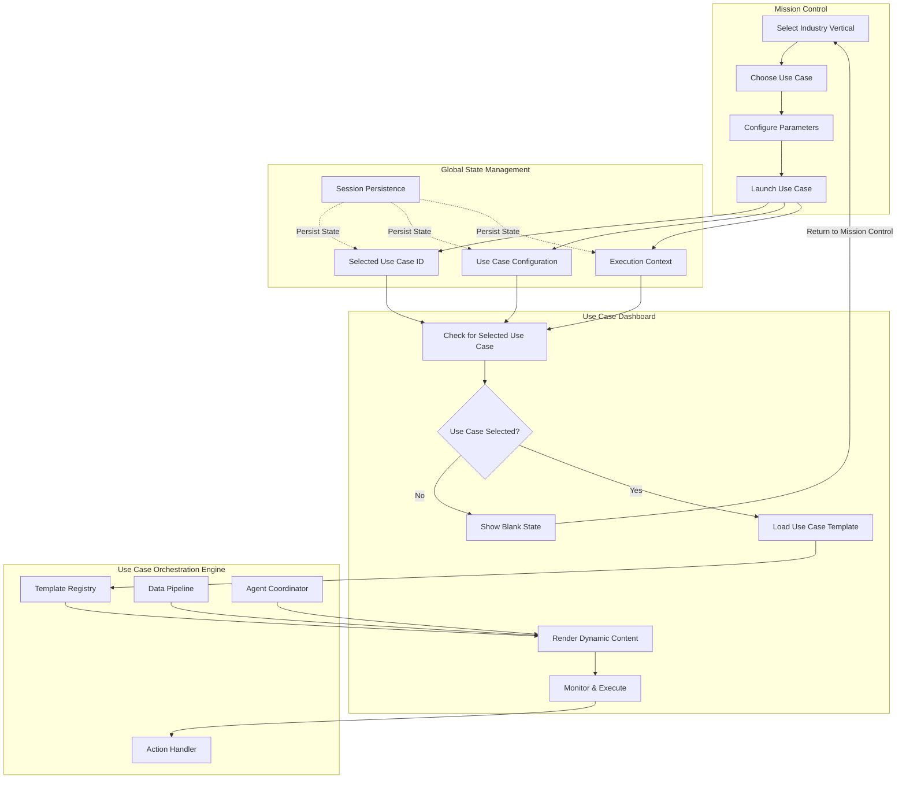
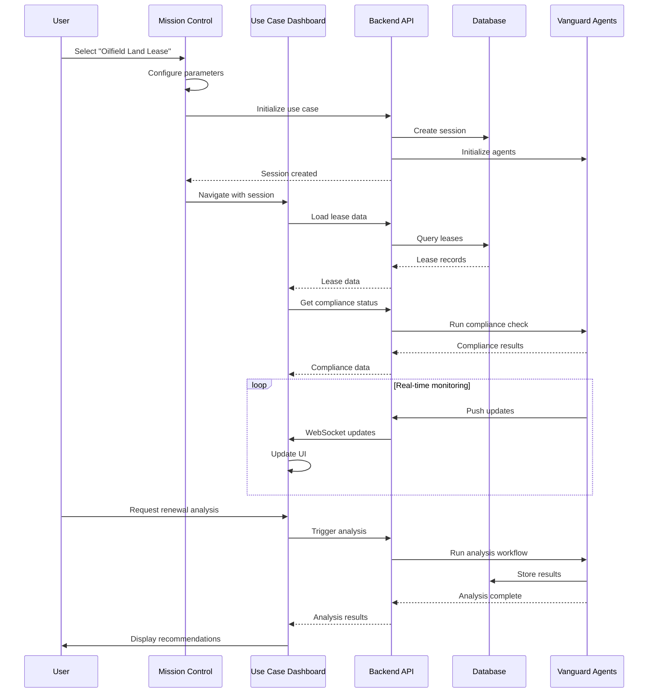

# Use Case Dashboard Flow & Integration

## Visual Flow Diagram



## Key Integration Points

### 1. Mission Control → Use Case Dashboard

```typescript
// In Mission Control when launching a use case
const handleLaunchUseCase = async (useCase: UseCase) => {
  // Set the selected use case in global state
  setSelectedUseCase(useCase.id, {
    vertical: useCase.vertical,
    name: useCase.name,
    configuration: useCase.config,
    launchedAt: new Date().toISOString()
  });
  
  // Navigate to Use Case Dashboard
  navigate('/use-case-dashboard');
};
```

### 2. Use Case Dashboard State Detection

```typescript
// In Use Case Dashboard
const UseCaseDashboard: React.FC = () => {
  const { selectedUseCase, selectedUseCaseDetails } = useMissionControlPersistence();
  
  // Check if a use case is selected
  if (!selectedUseCase || !selectedUseCaseDetails) {
    return <BlankState />;
  }
  
  // Load and render the appropriate template
  return <UseCaseRenderer 
    useCaseId={selectedUseCase}
    details={selectedUseCaseDetails}
  />;
};
```

### 3. Blank State Component

```typescript
const BlankState: React.FC = () => {
  const navigate = useNavigate();
  
  return (
    <div className="flex flex-col items-center justify-center min-h-screen">
      <div className="text-center max-w-2xl">
        <MapIcon className="w-24 h-24 text-gray-600 mx-auto mb-6" />
        <h2 className="text-3xl font-bold text-white mb-4">
          No Use Case Selected
        </h2>
        <p className="text-gray-400 mb-8">
          The Use Case Dashboard displays detailed analytics and controls for your selected use case. 
          Please select a use case from Mission Control to begin.
        </p>
        <Button
          variant="primary"
          size="lg"
          onClick={() => navigate('/mission-control')}
        >
          <ArrowLeftIcon className="w-5 h-5 mr-2" />
          Go to Mission Control
        </Button>
      </div>
    </div>
  );
};
```

### 4. Dynamic Template Loading

```typescript
// UseCaseRenderer component
const UseCaseRenderer: React.FC<UseCaseRendererProps> = ({ useCaseId, details }) => {
  const [template, setTemplate] = useState<UseCaseTemplate | null>(null);
  const [loading, setLoading] = useState(true);
  const orchestrator = useUseCaseOrchestrator();
  
  useEffect(() => {
    const loadTemplate = async () => {
      try {
        // Load template from orchestration engine
        const useCaseTemplate = await orchestrator.loadTemplate(useCaseId);
        setTemplate(useCaseTemplate);
        
        // Initialize data pipeline
        await orchestrator.initializeDataPipeline(useCaseId);
        
        // Start agent coordination
        await orchestrator.startAgentCoordination(useCaseId);
        
        setLoading(false);
      } catch (error) {
        console.error('Failed to load use case template:', error);
        toast.error('Failed to load use case');
      }
    };
    
    loadTemplate();
    
    // Cleanup on unmount
    return () => {
      orchestrator.cleanup(useCaseId);
    };
  }, [useCaseId]);
  
  if (loading) {
    return <LoadingState />;
  }
  
  if (!template) {
    return <ErrorState />;
  }
  
  // Render the template
  return <TemplateRenderer template={template} />;
};
```

## Oilfield Land Lease Specific Flow

### Data Flow for Oilfield Land Lease



### Component Structure for Oilfield Land Lease

```
OilfieldLandLease/
├── index.tsx                    # Main template component
├── components/
│   ├── ExecutiveOverview/
│   │   ├── index.tsx
│   │   ├── PainPointsCard.tsx
│   │   ├── ROICalculator.tsx
│   │   └── IndustryBenchmarks.tsx
│   ├── LeasePortfolio/
│   │   ├── index.tsx
│   │   ├── LeaseGrid.tsx
│   │   ├── LeaseMap.tsx
│   │   ├── LeaseDetails.tsx
│   │   └── FilterPanel.tsx
│   ├── ComplianceRisk/
│   │   ├── index.tsx
│   │   ├── SIAScorecard.tsx
│   │   ├── RiskHeatmap.tsx
│   │   ├── ComplianceTimeline.tsx
│   │   └── AuditTrail.tsx
│   ├── FinancialAnalytics/
│   │   ├── index.tsx
│   │   ├── PortfolioValuation.tsx
│   │   ├── RevenueOptimization.tsx
│   │   ├── MarketComparison.tsx
│   │   └── CostAnalysis.tsx
│   ├── VanguardActions/
│   │   ├── index.tsx
│   │   ├── AgentInsights.tsx
│   │   ├── RecommendationPanel.tsx
│   │   ├── AutomationStatus.tsx
│   │   └── ActionHistory.tsx
│   └── Workflows/
│       ├── index.tsx
│       ├── RenewalPipeline.tsx
│       ├── DocumentManager.tsx
│       ├── ApprovalFlow.tsx
│       └── IntegrationStatus.tsx
├── hooks/
│   ├── useLeaseData.ts
│   ├── useComplianceMonitor.ts
│   ├── useVanguardActions.ts
│   └── useRealTimeUpdates.ts
├── services/
│   ├── leaseService.ts
│   ├── complianceService.ts
│   ├── analyticsService.ts
│   └── vanguardService.ts
└── config.ts
```

## Implementation Checklist

### Phase 1: MVP (Essential Features)
- [ ] Create blank Use Case Dashboard page
- [ ] Implement state detection from Mission Control
- [ ] Create basic template loading system
- [ ] Build LeaseGrid component with mock data
- [ ] Add basic metrics display
- [ ] Implement navigation back to Mission Control

### Phase 2: Core Features
- [ ] Implement Use Case Orchestration Engine
- [ ] Add real API integration for lease data
- [ ] Create LeaseMap component
- [ ] Add compliance monitoring
- [ ] Implement basic Vanguard agent integration

### Phase 3: Advanced Features
- [ ] Add real-time WebSocket updates
- [ ] Implement workflow automation
- [ ] Add financial analytics
- [ ] Create reporting system
- [ ] Add export capabilities

### Phase 4: Polish
- [ ] Performance optimization
- [ ] Enhanced visualizations
- [ ] Mobile responsiveness
- [ ] Comprehensive testing
- [ ] Documentation

## Key Considerations

1. **State Synchronization**: Ensure Mission Control and Use Case Dashboard share state properly
2. **Performance**: Lazy load components and data as needed
3. **Scalability**: Design to support multiple use cases without code changes
4. **Security**: Ensure proper access controls for sensitive lease data
5. **User Experience**: Smooth transitions and clear feedback
6. **Error Handling**: Graceful degradation when services are unavailable