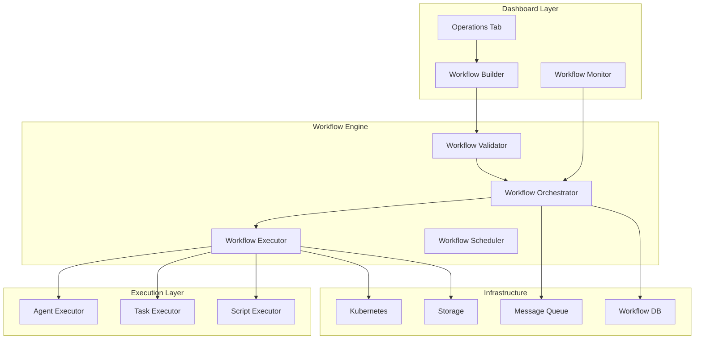
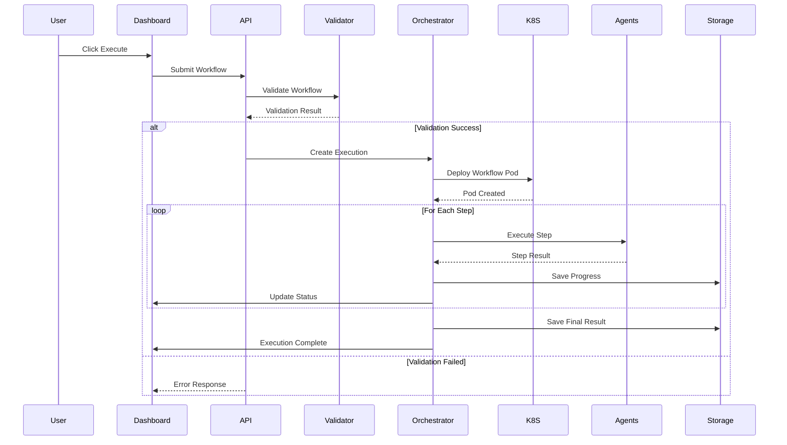

# Workflow Deployment Architecture

## Overview
This document outlines the architecture for deploying and executing workflows from the Operations tab of the run dashboard, enabling seamless automation of complex tasks.

## Workflow Architecture

### 1. Workflow System Overview



### 2. Workflow Definition Structure

```typescript
interface WorkflowDefinition {
  id: string;
  name: string;
  description: string;
  useCase: string;
  version: string;
  
  // Workflow metadata
  metadata: {
    author: string;
    created: string;
    modified: string;
    tags: string[];
    category: 'data-processing' | 'analysis' | 'reporting' | 'automation';
  };
  
  // Input requirements
  inputs: {
    required: WorkflowInput[];
    optional: WorkflowInput[];
    validation: ValidationRule[];
  };
  
  // Workflow steps
  steps: WorkflowStep[];
  
  // Output configuration
  outputs: {
    format: 'json' | 'csv' | 'report' | 'dashboard';
    destination: 'dashboard' | 'storage' | 'email' | 'api';
    schema: OutputSchema;
  };
  
  // Execution configuration
  execution: {
    mode: 'sequential' | 'parallel' | 'conditional';
    timeout: number;
    retries: number;
    errorHandling: 'stop' | 'continue' | 'rollback';
  };
}

interface WorkflowStep {
  id: string;
  name: string;
  type: 'agent' | 'task' | 'decision' | 'transform' | 'notify';
  
  // Step configuration
  config: {
    agent?: string;
    task?: TaskConfig;
    condition?: ConditionConfig;
    transform?: TransformConfig;
    notification?: NotificationConfig;
  };
  
  // Dependencies
  dependsOn: string[];
  
  // Error handling
  onError: 'fail' | 'skip' | 'retry' | 'fallback';
  fallback?: WorkflowStep;
}
```

### 3. Execute Button Implementation

```typescript
// Enhanced Operations Tab with Execute Workflow
export const OperationsTab: React.FC<{
  useCase: UseCase;
  data: DashboardData;
  hasLiveData: boolean;
}> = ({ useCase, data, hasLiveData }) => {
  const [workflows, setWorkflows] = useState<WorkflowDefinition[]>([]);
  const [selectedWorkflow, setSelectedWorkflow] = useState<string | null>(null);
  const [executing, setExecuting] = useState(false);
  const [executionStatus, setExecutionStatus] = useState<ExecutionStatus | null>(null);
  
  // Load available workflows
  useEffect(() => {
    const loadWorkflows = async () => {
      const available = await workflowService.getWorkflowsForUseCase(useCase.id);
      setWorkflows(available);
    };
    loadWorkflows();
  }, [useCase]);
  
  // Execute workflow handler
  const handleExecuteWorkflow = async () => {
    if (!selectedWorkflow || !hasLiveData) return;
    
    setExecuting(true);
    
    try {
      // Create execution context
      const context: WorkflowContext = {
        workflowId: selectedWorkflow,
        useCase: useCase.id,
        data: data,
        user: getCurrentUser(),
        timestamp: new Date().toISOString()
      };
      
      // Start execution
      const execution = await workflowService.executeWorkflow(context);
      
      // Monitor execution
      monitorExecution(execution.id);
      
    } catch (error) {
      console.error('Workflow execution failed:', error);
      showErrorNotification('Failed to execute workflow');
    } finally {
      setExecuting(false);
    }
  };
  
  return (
    <div className="operations-tab">
      {/* Workflow Selection */}
      <Card>
        <CardHeader>
          <CardTitle>Workflow Execution</CardTitle>
        </CardHeader>
        <CardContent>
          {!hasLiveData ? (
            <Alert variant="warning">
              <AlertDescription>
                Please ingest data before executing workflows
              </AlertDescription>
            </Alert>
          ) : (
            <>
              <Select
                value={selectedWorkflow}
                onChange={setSelectedWorkflow}
                disabled={executing}
              >
                <option value="">Select a workflow...</option>
                {workflows.map(wf => (
                  <option key={wf.id} value={wf.id}>
                    {wf.name} - {wf.description}
                  </option>
                ))}
              </Select>
              
              <Button
                variant="primary"
                onClick={handleExecuteWorkflow}
                disabled={!selectedWorkflow || executing}
                className="mt-4"
              >
                {executing ? (
                  <>
                    <Spinner className="mr-2" />
                    Executing...
                  </>
                ) : (
                  <>
                    <PlayIcon className="mr-2" />
                    Execute Workflow
                  </>
                )}
              </Button>
            </>
          )}
        </CardContent>
      </Card>
      
      {/* Execution Status */}
      {executionStatus && (
        <WorkflowExecutionMonitor
          status={executionStatus}
          onCancel={() => cancelExecution(executionStatus.id)}
        />
      )}
    </div>
  );
};
```

### 4. Workflow Execution Service

```typescript
// packages/frontend/src/services/workflow.service.ts

export class WorkflowService {
  private wsConnection: WebSocket;
  private executionCallbacks: Map<string, ExecutionCallback>;
  
  constructor() {
    this.initializeWebSocket();
  }
  
  // Execute workflow
  async executeWorkflow(context: WorkflowContext): Promise<WorkflowExecution> {
    // Validate context
    const validation = await this.validateContext(context);
    if (!validation.isValid) {
      throw new ValidationError(validation.errors);
    }
    
    // Create execution request
    const request: ExecutionRequest = {
      id: generateExecutionId(),
      workflowId: context.workflowId,
      context: context,
      priority: this.calculatePriority(context),
      scheduledAt: new Date().toISOString()
    };
    
    // Submit to backend
    const response = await fetch('/api/workflows/execute', {
      method: 'POST',
      headers: { 'Content-Type': 'application/json' },
      body: JSON.stringify(request)
    });
    
    if (!response.ok) {
      throw new Error('Failed to start workflow execution');
    }
    
    const execution = await response.json();
    
    // Setup monitoring
    this.setupExecutionMonitoring(execution.id);
    
    return execution;
  }
  
  // Monitor execution progress
  private setupExecutionMonitoring(executionId: string): void {
    // Subscribe to WebSocket updates
    this.wsConnection.send(JSON.stringify({
      action: 'subscribe',
      executionId: executionId
    }));
  }
  
  // Handle execution updates
  private handleExecutionUpdate(update: ExecutionUpdate): void {
    const callback = this.executionCallbacks.get(update.executionId);
    if (!callback) return;
    
    switch (update.type) {
      case 'PROGRESS':
        callback.onProgress?.(update.progress);
        break;
        
      case 'STEP_COMPLETE':
        callback.onStepComplete?.(update.step);
        break;
        
      case 'LOG':
        callback.onLog?.(update.log);
        break;
        
      case 'COMPLETE':
        callback.onComplete?.(update.result);
        this.executionCallbacks.delete(update.executionId);
        break;
        
      case 'ERROR':
        callback.onError?.(update.error);
        this.executionCallbacks.delete(update.executionId);
        break;
    }
  }
}
```

### 5. Workflow Execution Monitor Component

```typescript
export const WorkflowExecutionMonitor: React.FC<{
  status: ExecutionStatus;
  onCancel: () => void;
}> = ({ status, onCancel }) => {
  const [logs, setLogs] = useState<ExecutionLog[]>([]);
  const [expanded, setExpanded] = useState(true);
  
  useEffect(() => {
    // Subscribe to execution updates
    const unsubscribe = workflowService.subscribeToExecution(status.id, {
      onLog: (log) => setLogs(prev => [...prev, log]),
      onProgress: (progress) => {
        // Update progress in parent component
      }
    });
    
    return unsubscribe;
  }, [status.id]);
  
  return (
    <Card className="workflow-monitor mt-4">
      <CardHeader>
        <div className="flex items-center justify-between">
          <div className="flex items-center">
            <h3 className="text-lg font-semibold">
              Workflow: {status.workflowName}
            </h3>
            <Badge
              variant={getStatusVariant(status.state)}
              className="ml-2"
            >
              {status.state}
            </Badge>
          </div>
          <div className="flex items-center space-x-2">
            <Button
              variant="ghost"
              size="small"
              onClick={() => setExpanded(!expanded)}
            >
              {expanded ? <ChevronUpIcon /> : <ChevronDownIcon />}
            </Button>
            {status.state === 'RUNNING' && (
              <Button
                variant="danger"
                size="small"
                onClick={onCancel}
              >
                Cancel
              </Button>
            )}
          </div>
        </div>
      </CardHeader>
      
      {expanded && (
        <CardContent>
          {/* Progress Bar */}
          <div className="mb-4">
            <div className="flex justify-between text-sm text-gray-600 mb-1">
              <span>Progress</span>
              <span>{status.progress}%</span>
            </div>
            <Progress value={status.progress} />
          </div>
          
          {/* Step Status */}
          <div className="mb-4">
            <h4 className="text-sm font-medium mb-2">Steps</h4>
            <div className="space-y-2">
              {status.steps.map((step) => (
                <StepStatus key={step.id} step={step} />
              ))}
            </div>
          </div>
          
          {/* Execution Logs */}
          <div className="mt-4">
            <h4 className="text-sm font-medium mb-2">Execution Logs</h4>
            <div className="bg-gray-900 rounded p-3 h-48 overflow-y-auto">
              {logs.map((log, idx) => (
                <LogEntry key={idx} log={log} />
              ))}
            </div>
          </div>
        </CardContent>
      )}
    </Card>
  );
};
```

### 6. Workflow Deployment Pipeline



### 7. Kubernetes Deployment Configuration

```yaml
# workflow-executor-deployment.yaml
apiVersion: apps/v1
kind: Deployment
metadata:
  name: workflow-executor
  namespace: vanguards
spec:
  replicas: 3
  selector:
    matchLabels:
      app: workflow-executor
  template:
    metadata:
      labels:
        app: workflow-executor
    spec:
      containers:
      - name: executor
        image: vanguards/workflow-executor:latest
        env:
        - name: AGENT_ENDPOINT
          value: "http://agent-service:8080"
        - name: STORAGE_BUCKET
          value: "vanguards-workflows"
        resources:
          requests:
            memory: "512Mi"
            cpu: "500m"
          limits:
            memory: "2Gi"
            cpu: "2000m"
---
apiVersion: v1
kind: Service
metadata:
  name: workflow-executor-service
  namespace: vanguards
spec:
  selector:
    app: workflow-executor
  ports:
  - port: 8080
    targetPort: 8080
```

### 8. Workflow Templates

```typescript
// Pre-defined workflow templates for common use cases
export const workflowTemplates: Record<string, WorkflowDefinition> = {
  'oilfield-lease-renewal': {
    id: 'oilfield-lease-renewal',
    name: 'Lease Renewal Analysis',
    description: 'Analyze expiring leases and generate renewal recommendations',
    useCase: 'oilfield-land-lease',
    version: '1.0.0',
    
    steps: [
      {
        id: 'fetch-expiring',
        name: 'Fetch Expiring Leases',
        type: 'task',
        config: {
          task: {
            type: 'query',
            query: 'SELECT * FROM leases WHERE expiry_date < DATE_ADD(NOW(), INTERVAL 90 DAY)'
          }
        },
        dependsOn: []
      },
      {
        id: 'analyze-performance',
        name: 'Analyze Lease Performance',
        type: 'agent',
        config: {
          agent: 'energy-lease'
        },
        dependsOn: ['fetch-expiring']
      },
      {
        id: 'risk-assessment',
        name: 'Assess Renewal Risks',
        type: 'agent',
        config: {
          agent: 'red-flag'
        },
        dependsOn: ['analyze-performance']
      },
      {
        id: 'generate-recommendations',
        name: 'Generate Recommendations',
        type: 'agent',
        config: {
          agent: 'decision-tree'
        },
        dependsOn: ['risk-assessment']
      },
      {
        id: 'create-report',
        name: 'Create Renewal Report',
        type: 'transform',
        config: {
          transform: {
            template: 'lease-renewal-report',
            format: 'pdf'
          }
        },
        dependsOn: ['generate-recommendations']
      }
    ],
    
    outputs: {
      format: 'report',
      destination: 'dashboard',
      schema: {
        recommendations: 'array',
        riskAnalysis: 'object',
        financialImpact: 'object'
      }
    }
  },
  
  'compliance-audit': {
    id: 'compliance-audit',
    name: 'Compliance Audit Workflow',
    description: 'Run comprehensive compliance checks and generate audit report',
    useCase: 'oilfield-land-lease',
    version: '1.0.0',
    
    steps: [
      {
        id: 'gather-data',
        name: 'Gather Compliance Data',
        type: 'task',
        config: {
          task: {
            type: 'aggregate',
            sources: ['leases', 'permits', 'inspections', 'violations']
          }
        },
        dependsOn: []
      },
      {
        id: 'integrity-check',
        name: 'Data Integrity Check',
        type: 'agent',
        config: {
          agent: 'integrity-auditor'
        },
        dependsOn: ['gather-data']
      },
      {
        id: 'compliance-validation',
        name: 'Validate Compliance',
        type: 'agent',
        config: {
          agent: 'accuracy-engine'
        },
        dependsOn: ['integrity-check']
      },
      {
        id: 'generate-audit',
        name: 'Generate Audit Report',
        type: 'transform',
        config: {
          transform: {
            template: 'compliance-audit',
            includeEvidence: true
          }
        },
        dependsOn: ['compliance-validation']
      }
    ]
  }
};
```

### 9. Error Handling and Recovery

```typescript
interface WorkflowErrorHandler {
  // Handle different error types
  handleError(error: WorkflowError): ErrorResolution {
    switch (error.type) {
      case 'STEP_FAILED':
        return this.handleStepFailure(error);
        
      case 'TIMEOUT':
        return this.handleTimeout(error);
        
      case 'RESOURCE_UNAVAILABLE':
        return this.handleResourceError(error);
        
      case 'VALIDATION_FAILED':
        return this.handleValidationError(error);
        
      default:
        return this.handleUnknownError(error);
    }
  }
  
  // Step failure recovery
  private handleStepFailure(error: StepError): ErrorResolution {
    const step = error.step;
    
    // Check retry policy
    if (step.retries < step.maxRetries) {
      return {
        action: 'RETRY',
        delay: this.calculateBackoff(step.retries),
        message: `Retrying step ${step.name} (${step.retries + 1}/${step.maxRetries})`
      };
    }
    
    // Check for fallback
    if (step.fallback) {
      return {
        action: 'FALLBACK',
        fallbackStep: step.fallback,
        message: `Executing fallback for ${step.name}`
      };
    }
    
    // Check error handling policy
    if (step.onError === 'skip') {
      return {
        action: 'SKIP',
        message: `Skipping failed step ${step.name}`
      };
    }
    
    return {
      action: 'FAIL',
      message: `Step ${step.name} failed after ${step.maxRetries} retries`
    };
  }
}
```

### 10. Performance Optimization

1. **Parallel Execution**: Execute independent steps concurrently
2. **Resource Pooling**: Reuse agent connections and resources
3. **Caching**: Cache intermediate results for reuse
4. **Streaming**: Stream large datasets instead of loading in memory
5. **Checkpointing**: Save progress for long-running workflows

### 11. Security Considerations

1. **Authentication**: Verify user permissions before execution
2. **Input Validation**: Validate all workflow inputs
3. **Sandboxing**: Execute workflows in isolated environments
4. **Audit Trail**: Log all workflow executions
5. **Data Encryption**: Encrypt sensitive data in transit and at rest